# Portfolio: Digital Design & Fabrication
## Exercise 1: Electrical Circuits

### Task 1.1: Simple LED Circuit
First, we prepared the electrical components and selected the appropriate resistors. The power supply was set to 5V and 1A. We started by reading the schematic and assembling the parts on the breadboard. 

During our first attempt, we faced two main challenges. First, we had forgotten how the positive, negative, and ground rails connect inside the breadboard cells. We initially assumed the right and left power rails were internally connected. Second, the LED did not turn on because we had connected it in reverse, forgetting that the longer pin (anode) must be connected to the positive side. We quickly identified and fixed these problems, and the circuit worked perfectly.

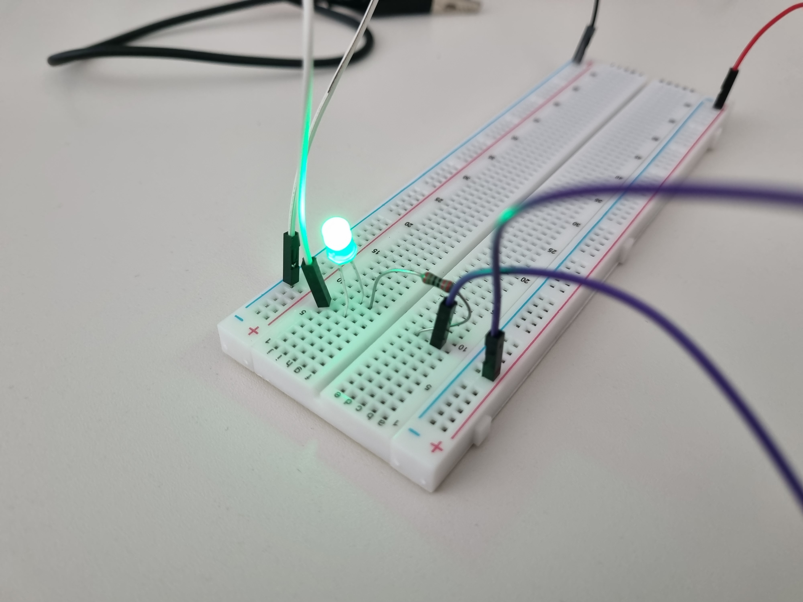

Next, we measured the voltage across R1 ($V_{1}$) and the LED ($V_{LED}$).

| R1 [Ω] | Measured $V_{1}$ [V] | Measured $V_{LED}$ [V] |
| :---: | :---: | :---: |
| 220 | 2.16 | 2.76 |
| 1000 | 2.50 | 2.47 |
| 4700 | 2.70 | 2.30 |

**Observations:** We observed that the voltage across R1 (220 Ω) was lower compared to when we used resistors with higher resistance. When we replaced the resistor with higher resistance ones (1 KΩ and 4.7 KΩ), the measured voltage of the LED dropped. However, the visual effect of the different resistors on the LED's brightness was not very noticeable to us.

---

### Task 1.2: Switchable LED Circuit
In this task, we added a switch to the base circuit as instructed in the schematic. Initially, the switch did not seem to work properly based on its labels. We soon realized that the "ON" and "OFF" printed labels were reversed, likely due to a manufacturing defect. 

Despite this, the primary function was intact, and it successfully turned the LED on and off. As requested, we also tested connecting the switch in the opposite direction. As expected, since a standard mechanical switch is not polarized, we observed no difference in its operation.

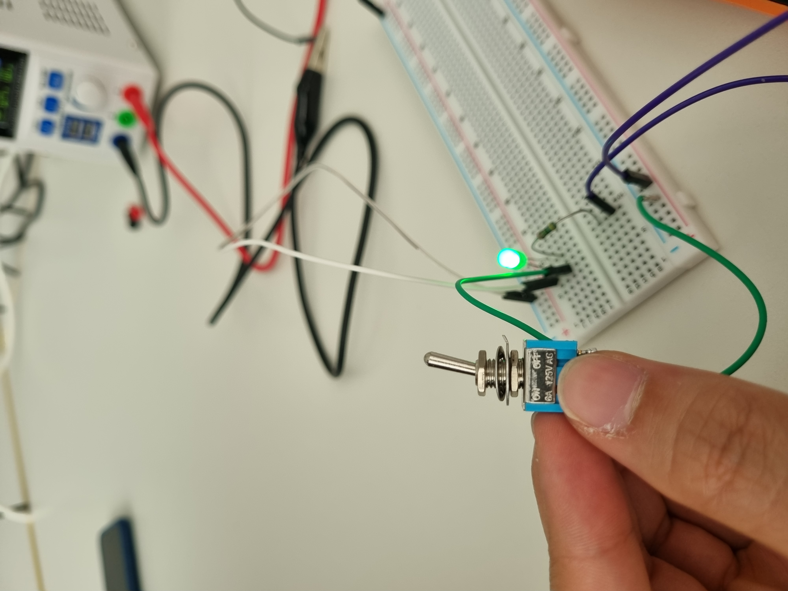

---

### Task 1.3: Dimmable LED Circuit
Wiring this circuit was slightly more challenging as we initially got confused about connecting the potentiometer's wiper (the middle pin) to the rest of the circuit. After reviewing the schematic, we successfully routed the connections and achieved the correct result. We then measured $V_{LED}$ and $V_{2}$ (voltage across the potentiometer) at different brightness levels.

| Position | $V_{LED}$ [V] | $V_{2}$ [V] |
| :--- | :---: | :---: |
| a) full brightness | 3.00 | 4.95 |
| b) dimmed | 2.21 | 2.23 |
| c) OFF | 0.0074 (7.4 mV) | 0.0062 (6.2 mV) |

**Observations:** We observed that rotating the potentiometer changes its resistance, which in turn alters the brightness of the LED. As the resistance of the potentiometer increased, $V_{LED}$ and $V_{2}$ decreased, which restricted the current and caused the LED to dim. A notable characteristic of this relationship is that it is not perfectly linear; once $V_{2}$ drops below the LED's minimum forward voltage threshold, the LED turns off completely (Position C).

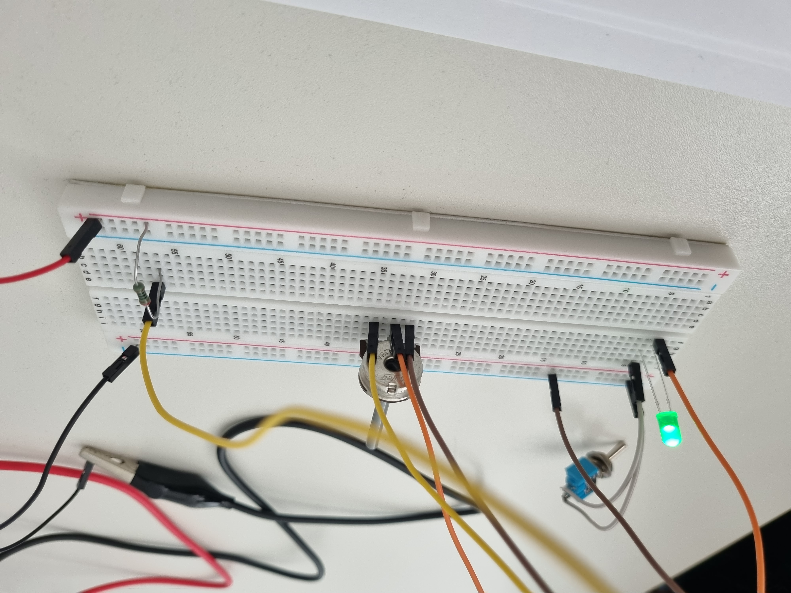

---

### Task 2.1: Switchable LED Strip
The assembly of this circuit was straightforward, and we successfully built it without any major challenges. 

**Observations & Principle of Operation:** In this circuit, the switch controls the Gate-Source voltage ($V_{GS}$) of the transistor. When the switch is closed, a 5V signal from the USB is applied to the Gate. This small control voltage turns the MOSFET "ON", allowing a much larger current to flow from the Drain to the Source ($V_{DS}$), which powers the 12V LED strip. The transistor effectively acts as an electronic bridge, allowing a safe, low-voltage 5V circuit to control a higher-power 12V load while keeping their power domains isolated, sharing only a common ground. Also, we measured the voltage on ($V_{GS}$) which was almost 5.2V and 11.7V on ($V_{DS}$).

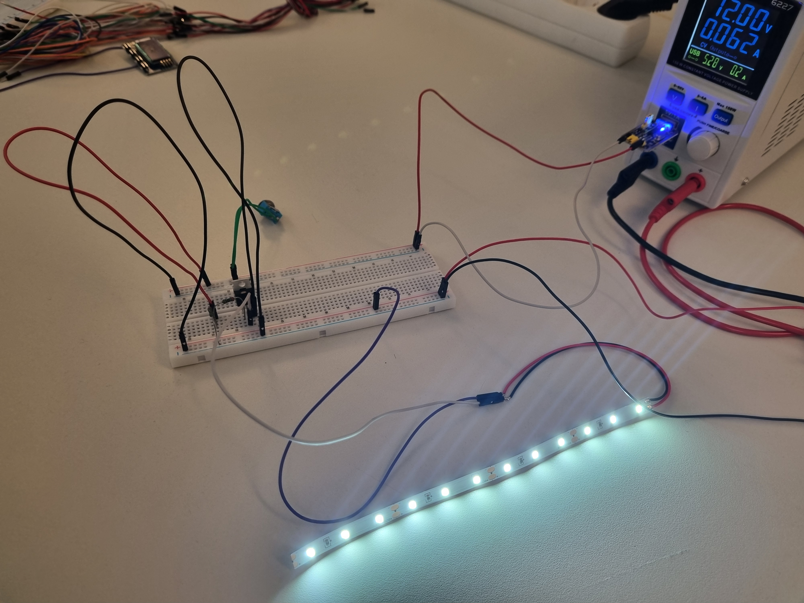

---

### Task 2.2: Dimmable LED Strip
In this task, we replaced the manual switch with a PWM (Pulse Width Modulation) signal generator set to 90Hz to control the MOSFET gate. 

**A) Adjusting Duty Cycle (D):**
We tested the LED strip at duty cycles of 2%, 15%, 40%, 75%, and 100%. We observed a direct relationship: as the duty cycle increases, the perceived brightness of the LED strip also increases. 

*Comparison with Task 1.3:* In Task 1.3, we used a potentiometer to dim the LED. The potentiometer works by resisting the flow of electricity, which drops the voltage and makes the light dimmer. The PWM method is different. Instead of dropping the voltage, PWM simply turns the full 12V power ON and OFF very quickly. The "Duty Cycle" just controls how long the power stays ON compared to OFF. Because it blinks so fast, our eyes blend the light together, making it look like a smooth, dimmed light.

**B) Adjusting Switching Frequency (f):**
Keeping the duty cycle at 50% ($D=0.5$), we tested frequencies of 5Hz, 25Hz, 45Hz, and 100Hz. At lower frequencies (like 5Hz, 25Hz and 45Hz), the flickering of the LED strip was highly visible and slow. As we increased the frequency, the flicker became faster. Around 55Hz, the flickering stopped being visible to the naked eye due to the human eye's persistence of vision. 

To investigate further, we recorded the LED strip using our smartphone's slow-motion camera at 240 FPS. Using this method, we were able to clearly capture and verify the rapid ON/OFF flickering even at 100Hz.

| Dimmable LED Strip 2.2 | SWM Wire Connections |
| :---: | :---: |
| 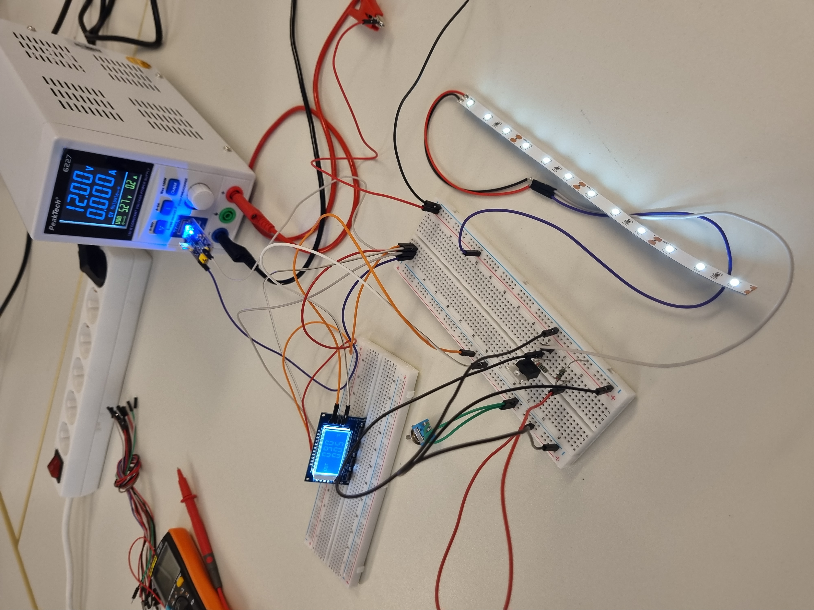 | 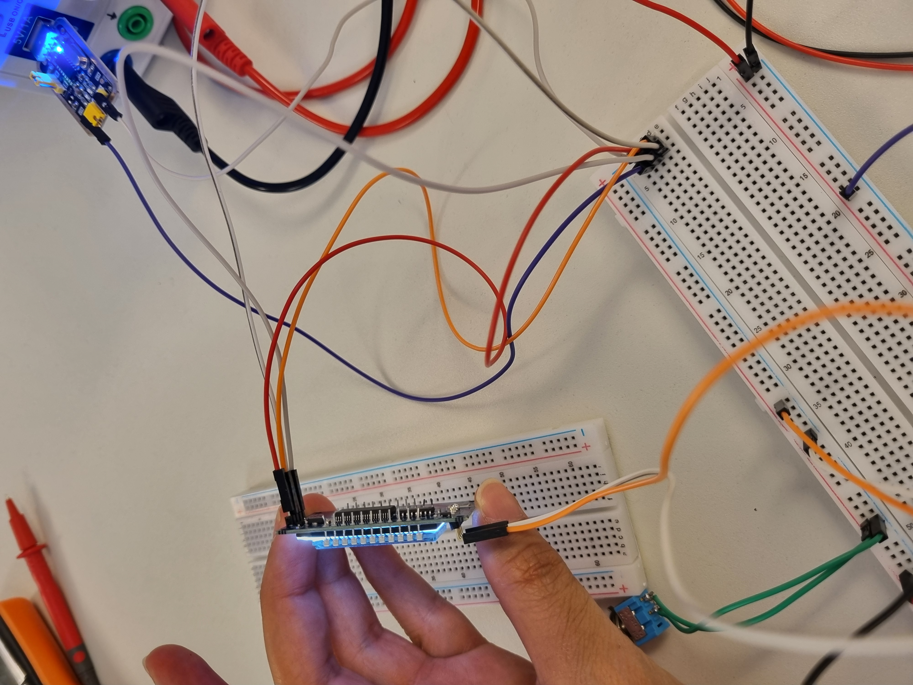 |

---

## Exercise 2: Arduino-Based Alarm Clock with Snooze Function

This exercise focused on building a functional Arduino alarm clock using an LCD screen, RTC module, buzzer, and push-button controls. The final version displays the current time, allows alarm control through buttons, and includes a snooze function.

---

### Task 1: Connecting the Buzzer

First, we tested the buzzer as the alarm output. We placed the buzzer on the breadboard and connected it to the Arduino digital output pin and ground. The Arduino itself was powered through a USB connection from the laptop USB port. The buzzer was controlled by changing the output state from LOW to HIGH. During testing, we manipulated the sequence and delay values of the buzzer and observed that changing these values changed the rhythm and timing of the sound. We also found that the buzzer did not necessarily need a resistor before it in our test setup, so it could be connected directly to a 5V digital output pin on the Arduino.

Code snippet used to test the buzzer output:

```cpp
const int buzzerPin = 8;

void setup() {
  pinMode(buzzerPin, OUTPUT);
}

void loop() {
  digitalWrite(buzzerPin, HIGH);
  delay(500);
  digitalWrite(buzzerPin, LOW);
  delay(500);
}
```

Buzzer test circuit connected to the Arduino Uno.

**Task Observation:** Many jumper wires made the circuit difficult to follow, so we tested the system in smaller blocks and checked connections one component at a time. Testing the buzzer separately helped us confirm that the alarm output worked before adding more parts to the circuit.

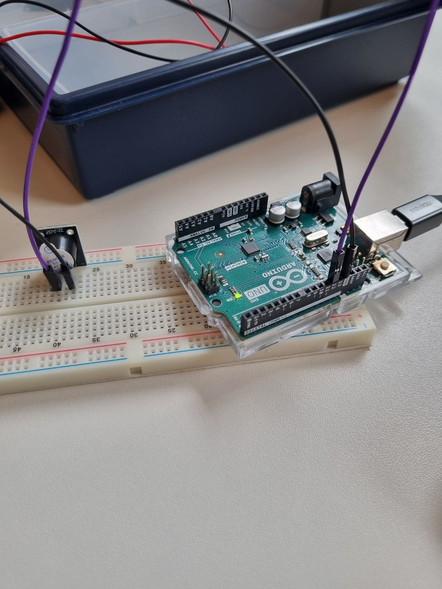

---

### Task 2: Connecting the LCD Screen

Next, we tested the 16x2 LCD screen using the I2C interface. This reduced the wiring to four connections: VCC, GND, SDA, and SCL. We connected the LCD VCC pin to the Arduino 5V pin, the LCD GND pin to the Arduino GND pin, SDA to A4, and SCL to A5 on the Arduino Uno.

Before running the LCD test code, we used the `I2C_scanner.ino` sketch to detect the LCD address. The scanner showed that our LCD address was `0x27`, so we used this address in the LCD code and successfully displayed text on the screen.

In the code part, we also had to install and include the required library for the LCD. For this display, we used the `LiquidCrystal_I2C` library with the following include line.

Important LCD code setting:

```cpp
#include <LiquidCrystal_I2C.h>

LiquidCrystal_I2C lcd(0x27, 16, 2);

void setup() {
  lcd.init();
  lcd.backlight();
  lcd.setCursor(0, 0);
  lcd.print("Whatever make sense to show");
}
```

LCD test showing a custom message on the display.

Arduino IDE and hardware setup during the LCD code test.

**Task Observation:** The I2C device needed the correct SDA and SCL wiring and also needed the correct device address. We used the I2C scanner to find the display address and then used `0x27` in the code. After checking the wiring and the address, the LCD displayed the test message correctly.

|  LCD connection |LCD connection code |
|:---:|:---:|
| 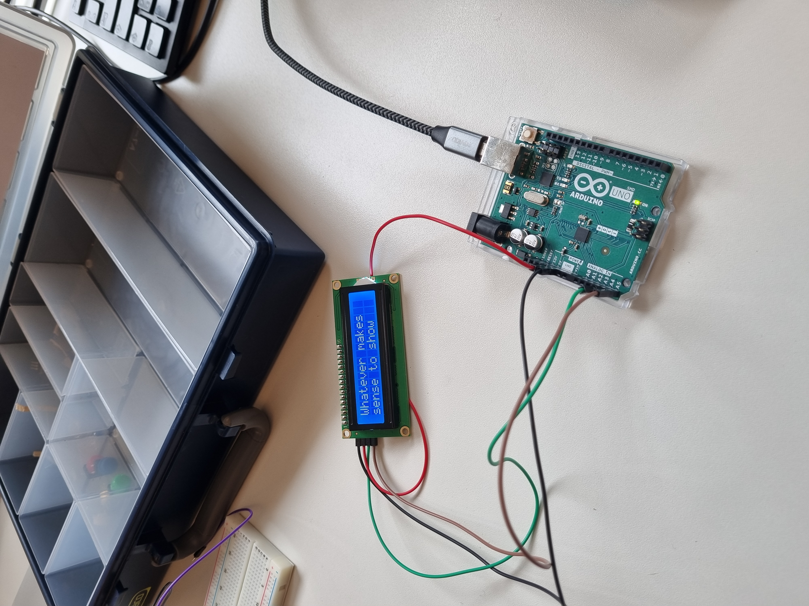 | 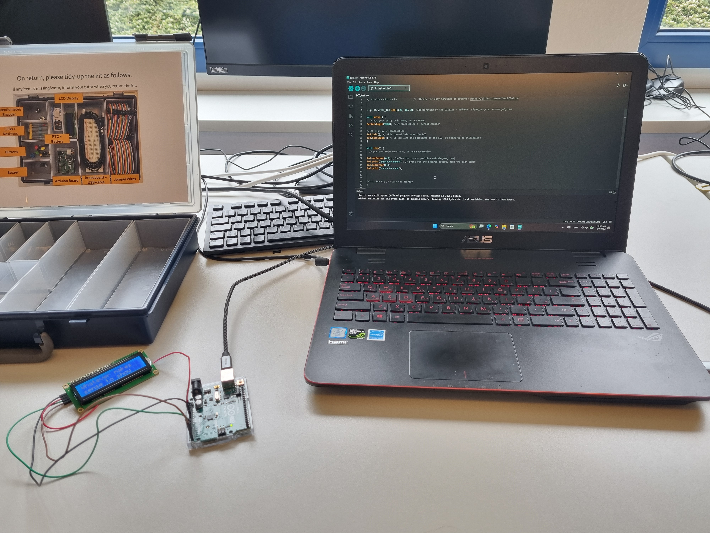 |


---

### Task 3: Expanding the Setup with a Real-Time Clock

After the LCD worked, we added the RTC module. Both the LCD and RTC use I2C communication, which means they both need the SDA and SCL pins on the Arduino. Since the Arduino Uno only has one SDA and one SCL connection, we made a parallel connection between the LCD, RTC, and Arduino, so both devices could share the same SDA and SCL pins. They also shared the same 5V and GND lines.

We used the `I2C_scanner.ino` sketch again to identify the RTC module address. The scanner showed the RTC address as `0x68`. After identifying the RTC address, we used the RTC_LCD partial test code to test the RTC module and display the current time on the LCD.

During the code testing, we found that the RTC module can be set to the current date and time at the beginning of the program. After the time is set, the RTC continues tracking it independently, and because it has its own separate battery, it can keep the time and date even when the Arduino is disconnected from power.

Code snippet used to read the RTC time:

```cpp
#include <RTClib.h>

RTC_DS3231 rtc;

void loop() {
  DateTime now = rtc.now();
  lcd.setCursor(0, 0);
  lcd.print(now.hour());
  lcd.print(":");
  lcd.print(now.minute());
}
```

RTC module connected with LCD and Arduino, displaying the current time.

**Task Observation:** The LCD and RTC both needed to use the same I2C communication lines. We kept the LCD and RTC on the same SDA and SCL lines and checked the display output after scanning the addresses. After completing the wiring and compiling the related RTC/LCD code, we observed the current time on the LCD. This confirmed that both I2C devices were connected correctly and could work together.

**RTC configuration**
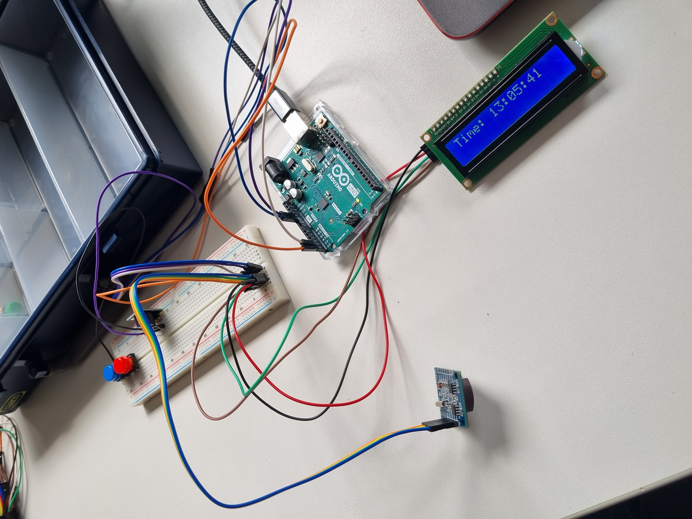

**RTC functionality**
--
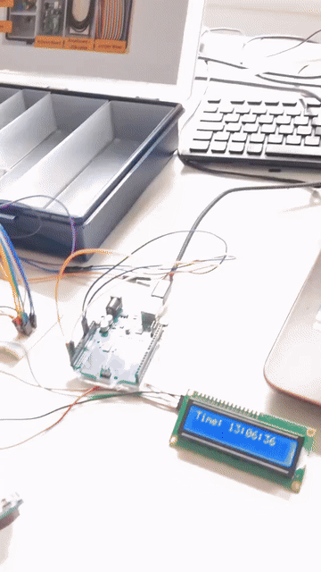


---

### Task 4: Using the Push Button

Before using the push button in the circuit, we first checked the button legs with a multimeter in continuity mode. This helped us understand which legs were internally connected. We realized that two of the button legs were connected together, and in our setup these were the legs that were farther away from each other on the breadboard layout.

To make the button easier to use, we placed it across the middle gap of the breadboard, as suggested by the manual-style setup. This position gave us better access to each button leg on separate breadboard blocks, which made the wiring clearer and reduced confusion during testing.

First, we added one push button to check the button press functionality and show the response on the display. After confirming that one button worked correctly, we added the rest of the push buttons to create a simple user interface for the alarm clock. The buttons were used for interaction with the system, such as changing values, stopping the alarm, and using the snooze function. After that, we used the button test code to check that each button press was detected correctly.

At the beginning, the buttons did not work reliably. To solve this, we changed the digital pins used on the Arduino, and after that the buttons started working correctly. We also had a grounding problem: even though we connected the grounds together on the breadboard and linked them to the Arduino GND, some parts of the circuit still did not work properly. We solved this by adding another GND connection from the other Arduino GND pin to the circuit, which made the ground connection more stable across the breadboard.

Code snippet used for the push button input:

```cpp
const int buttonPin = 2;

void setup() {
  pinMode(buttonPin, INPUT_PULLUP);
}

void loop() {
  int buttonState = digitalRead(buttonPin);
  if (buttonState == LOW) {
    // Button is pressed
  }
}
```

Close-up of the buzzer and push button area on the breadboard.

Button and buzzer wiring during interface testing.

**Task Observation:** Buttons could produce unstable readings if they were not handled properly. We used button testing and planned the control logic around reliable press detection. The buttons initially did not respond correctly, so we changed the digital pins and added another GND connection from the Arduino to make the ground connection more stable.

**Pushbutton placement on the breadboard**
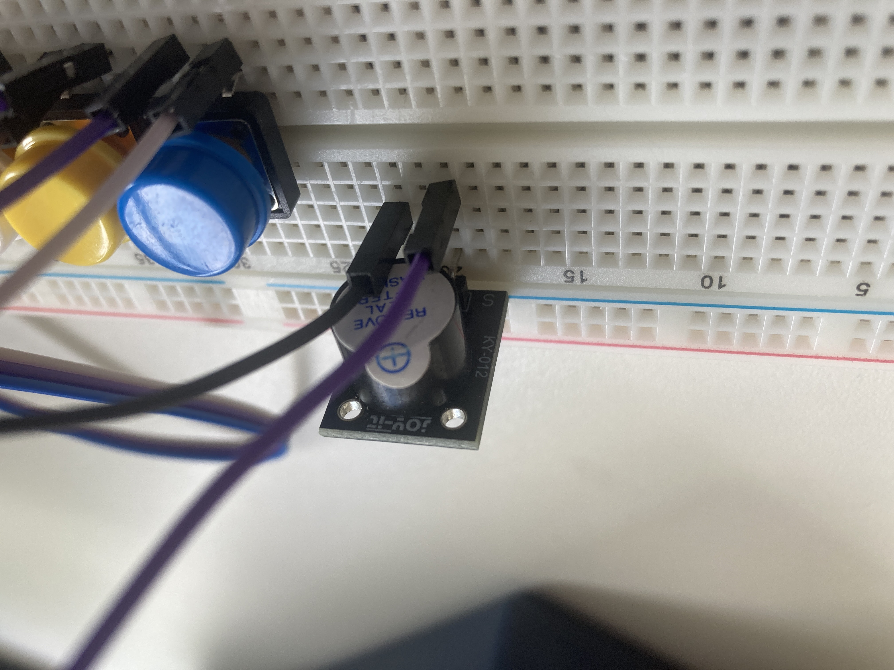

**Pushbutton function test**
--
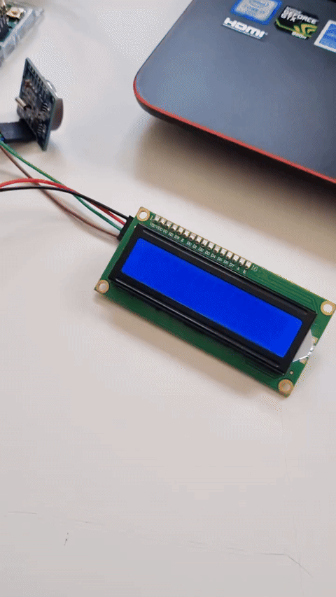


---

### Final Task: Build an Alarm Clock

After testing the individual parts, we combined them into one complete circuit. The final system used the RTC to keep time, the LCD to display time and alarm information, the buttons for control, and the buzzer for the alarm sound. We checked this against the manual flow and used the provided basic alarm clock example name, `DDF_Arduino101_AlarmClock.ino`, as the reference/base alarm clock program while adding our own control setup and snooze function.

We defined one push button for turning the alarm on and off, one button for changing the hour value, and another button for changing the minute value. We also added a snooze button, which delayed the alarm by 1 minute. We chose a short 1-minute snooze delay to clearly demonstrate the button control during testing, but this value can be changed and adjusted depending on the user’s needs. The final LCD output also showed a snooze message, which indicates that we extended the basic alarm idea with an additional alarm control feature.

Simplified alarm-checking logic:

```cpp
if (currentHour == alarmHour && currentMinute == alarmMinute) {
  digitalWrite(buzzerPin, HIGH);
}

if (stopButtonPressed) {
  digitalWrite(buzzerPin, LOW);
}
```

Work-in-progress assembly with Arduino, RTC, LCD, buzzer, and buttons.

Final alarm clock circuit with time and snooze information shown on the LCD.

**Final Task Observation:** During the final assembly, the circuit became visually complex because it included the LCD, RTC, buzzer, and several buttons together. We documented the process with photos so each part of the system could still be explained clearly. We also continued checking the circuit in smaller sections when something did not work as expected.

**Alarm clock functionality:** 
--
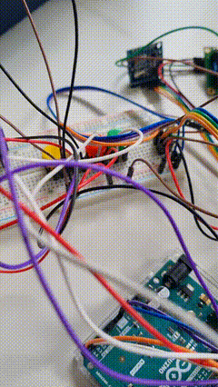

|Alarm clock control buttons |                      Alarm clock sonooze function                       |
|:---:|:-------------------------------------------------------------------:|
| 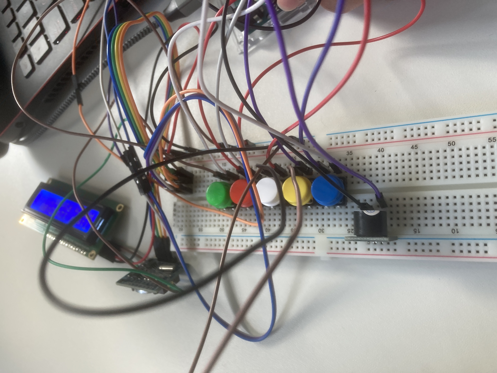 | 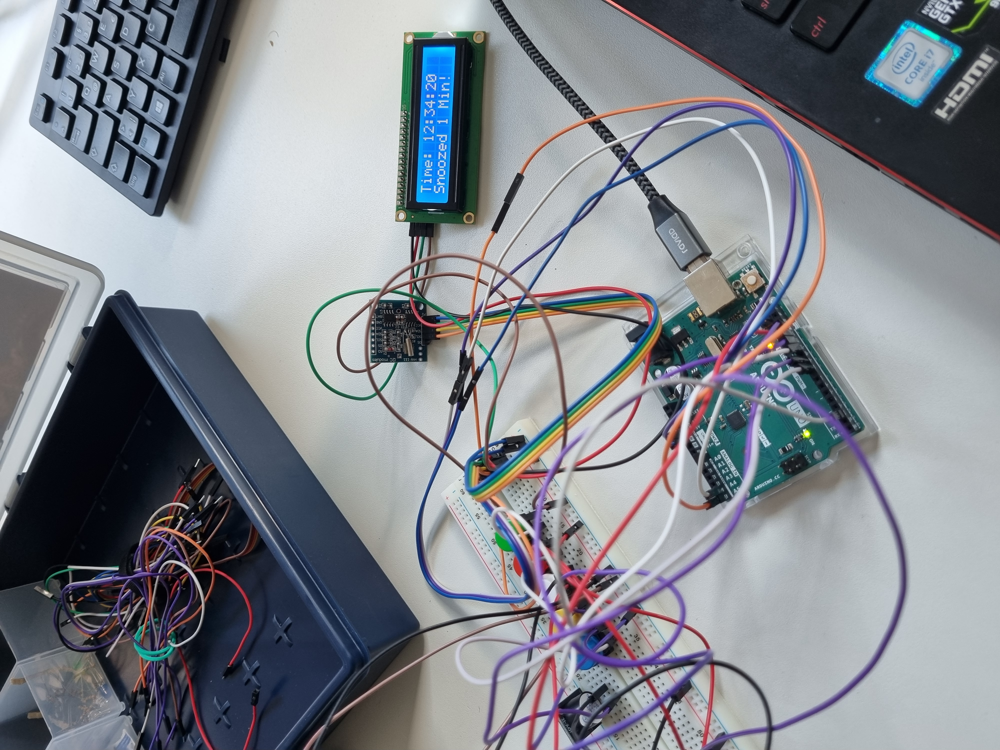 |

**Alarm clock snooze function:** 
--
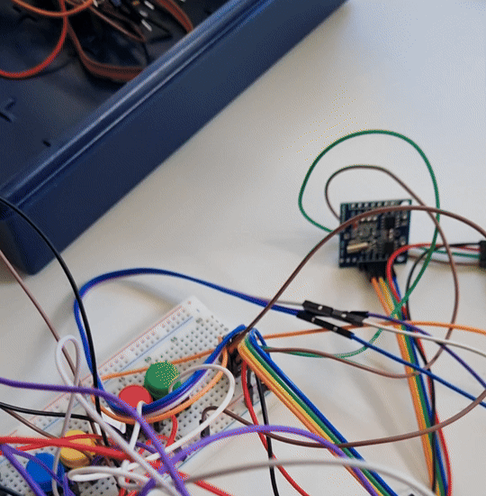

---

## Exercise 3: Sensors & Actuators

This exercise focused on building a pneumatic system controlled by an Arduino. The system consists of two air pumps (for inflation and deflation), an air valve, and an inflatable pillow, brought to life through a custom sensor-driven interaction.

### Part A: Testing MOSFETs and Pneumatic Circuit

Before building the complex system, we decided to break the project into smaller, manageable testing phases. 

**1. MOSFET Logic Test:**
To ensure all IRF520 MOSFET modules received signals properly, we initially wired them to the Arduino without connecting the high-current pumps or the valve.Initially, we connected all the ground pins together, but we soon realized this was unnecessary, so we removed the redundant wires. We wrote a simple test script to activate the digital pins one by one and checked the built-in status LEDs on the MOSFET modules. This safely confirmed that our control logic and wiring were correct.During the exercise, we encountered an interesting behavior: the MOSFET continued to function using only the signal and ground connections, even though its VCC pin was not connected to the Arduino's 5V pin.


**2. Pneumatic Integration:**
Next, we connected the ZR370-02PM air pumps and the FA0520E air valve to the load side of the MOSFETs, powered by the external lab supply. During this phase, we realized that the pumps should be connected to standard digital outputs rather than PWM pins to ensure reliable ON/OFF switching. We tested the inflate pump, deflate pump, and valve using a basic loop sequence, and the pneumatic circuit functioned perfectly.

```cpp
const int Deflate = 2;
const int Inflate = 4;
const int Valve = 8;

void setup() {
  pinMode(Inflate, OUTPUT);
  pinMode(Deflate, OUTPUT);
  pinMode(Valve, OUTPUT);
}

void loop() {
  delay(100);
  digitalWrite(Valve, LOW);
  digitalWrite(Inflate, HIGH);
  delay(5000);
  digitalWrite(Inflate, LOW);
  delay(1000);
  digitalWrite(Valve, HIGH);
  delay(1000);
  digitalWrite(Deflate, HIGH);
  delay(4500);
  digitalWrite(Deflate, LOW);
  delay(5000);
}
```

<table align="center">
  <tr>
    <th align="center">Pneumatic Setup</th>
    <th align="center">Functionality Of Pneumatic Circuit</th>
  </tr>
  <tr>
    <td align="center" valign="middle">
      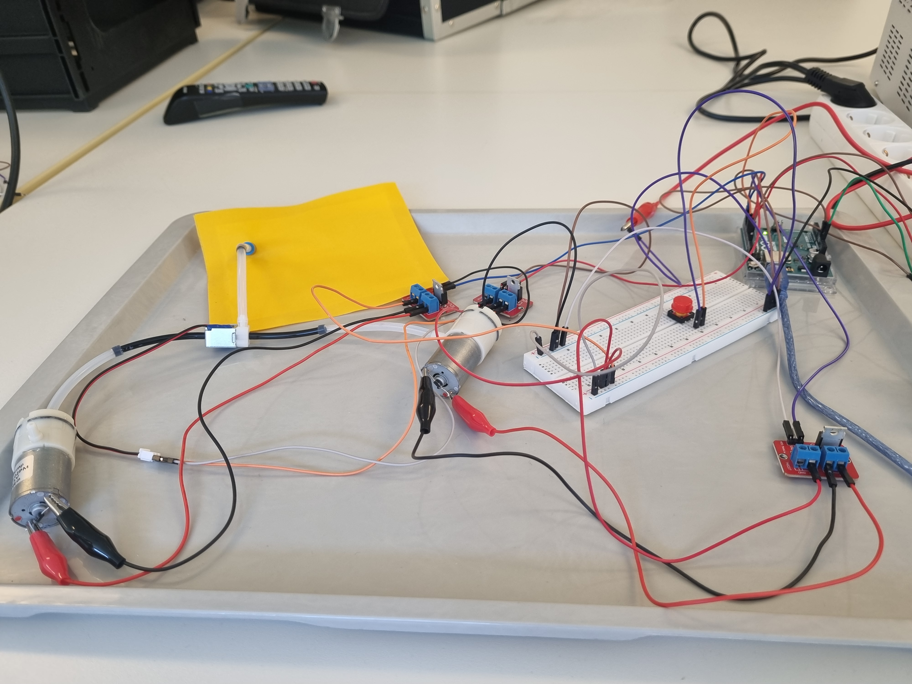
    </td>
    <td align="center" valign="middle">
      
    </td>
  </tr>
</table>

---

### Part B: Sensor Integration & Interaction Design

For the interactive part of the system, we wanted an intuitive and simple design first, which we could later expand upon. 

**Interaction Concept:**
We chose a "touchless inflation" approach using an HC-SR04 Ultrasonic Distance Sensor, paired with a tactile push-button for deflation. 
*   **Inflate:** Placing a hand close to the sensor (under 10 cm) mimics a magical or hover-based interaction, triggering the inflate pump and switching the valve.
*   **Deflate:** Pressing a physical button (acting as an analog release valve) triggers the deflate pump.

**Troubleshooting the Ultrasonic Sensor:**
When we first connected the ultrasonic sensor, the system did not respond to our hand gestures. At first, we assumed we needed to identify the I2C/serial address of the sensor. However, we later realized that this specific sensor operates differently and does not require an address. Then, To debug this, we used the `Serial.print()` function to read the raw `duration` values on the Serial Monitor. The monitor showed invalid values. After double-checking our code and wiring, we swapped the sensor for a new one. The new sensor worked flawlessly, leading us to the conclusion that the first sensor was defective.

---

### Final Implementation & Reflection

Once the hardware issues were resolved, we merged the sensor inputs and actuator outputs into the final code. 

**Final System Code:**
```cpp
const int pumpInflatePin = 4;
const int pumpDeflatePin = 2;
const int valvePin = 8;

const int trigPin = 12;     
const int echoPin = 13;     
const int buttonPin = 7;    

const int triggerDistanceCm = 10; 

void setup() {
  Serial.begin(9600);
  
  pinMode(pumpInflatePin, OUTPUT);
  pinMode(pumpDeflatePin, OUTPUT);
  pinMode(valvePin, OUTPUT);
  
  pinMode(trigPin, OUTPUT);
  pinMode(echoPin, INPUT);
  pinMode(buttonPin, INPUT_PULLUP); 

  digitalWrite(pumpInflatePin, LOW);
  digitalWrite(pumpDeflatePin, LOW);
  digitalWrite(valvePin, LOW);
}

void loop() {
  bool isDeflating = (digitalRead(buttonPin) == LOW);
  long duration;
  int distance;
  
  digitalWrite(trigPin, LOW);
  delayMicroseconds(2);
  digitalWrite(trigPin, HIGH);
  delayMicroseconds(10);
  digitalWrite(trigPin, LOW);
  
  duration = pulseIn(echoPin, HIGH);
  distance = duration * 0.034 / 2;

  if (isDeflating) {
    digitalWrite(valvePin, HIGH); 
    delay(500);
    digitalWrite(pumpDeflatePin, HIGH); 
    digitalWrite(pumpInflatePin, LOW);  
    Serial.println("Button pressed: Deflating...");
  } 
  else if (distance > 0 && distance < triggerDistanceCm) {
    digitalWrite(valvePin, LOW);  
    digitalWrite(pumpInflatePin, HIGH); 
    digitalWrite(pumpDeflatePin, LOW);  
    Serial.print("Hand detected at ");
    Serial.print(distance);
    Serial.println(" cm: Inflating...");
  } 
  else {
    digitalWrite(pumpInflatePin, LOW);
    digitalWrite(pumpDeflatePin, LOW);
  }
  
  delay(1000); 
}
```

<table align="center">
  <tr>
    <th align="center">Final Setup With Ultrasonic Sensor</th>
    <th align="center">Functionality Of Final Circuit</th>
  </tr>
  <tr>
    <td align="center" valign="middle">
      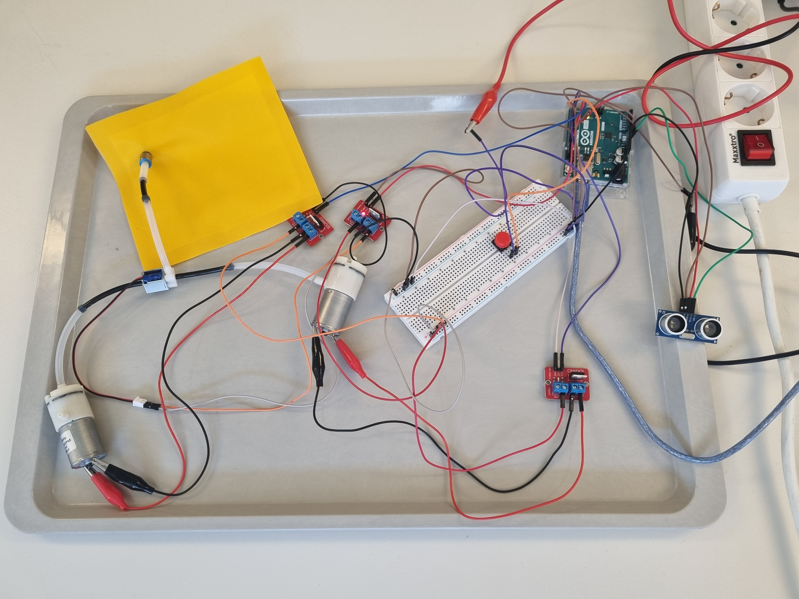
    </td>
    <td align="center" valign="middle">
      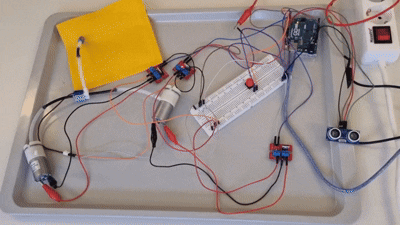
    </td>
  </tr>
</table>

---
# Exercise 4: E-Textile  LED Circuit

## Project Overview

This portfolio documents my e-textile exercise, where I designed and built a small textile object in the shape of a revolver. The object contains five blue LEDs, a coin cell battery, a battery holder with an on/off switch, conductive yarn, and two layers of fabric.

The goal of the exercise was to understand how conductive textile materials can be used to build a working circuit, and how resistance, polarity, and contact quality affect the final result.

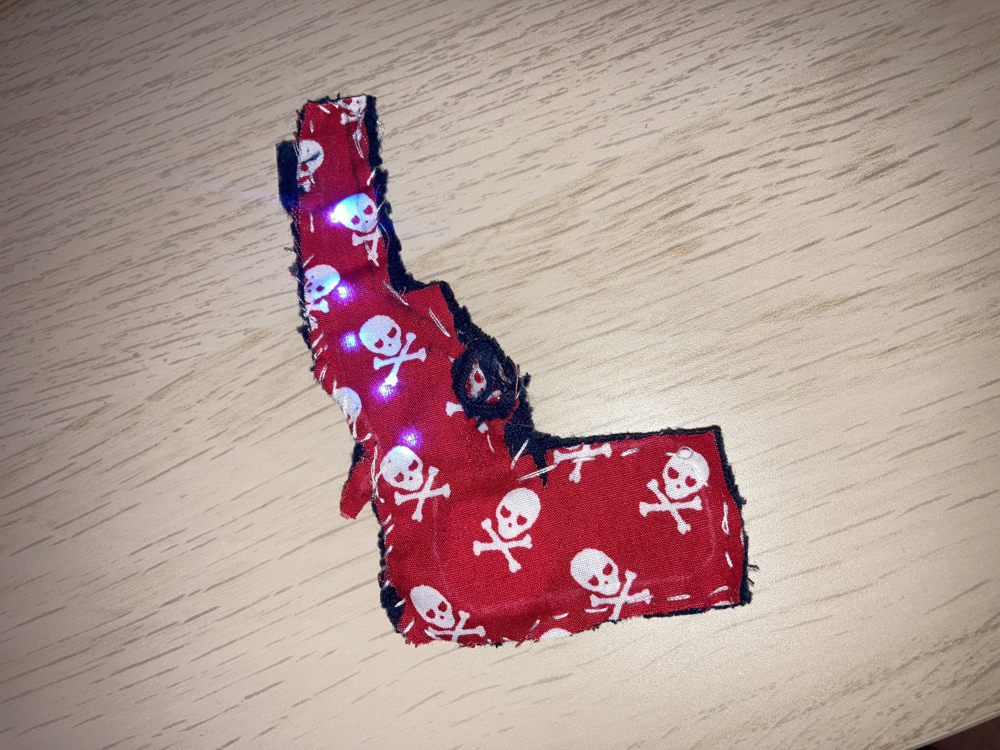

---

## Exercise Context

At the beginning of the exercise, we measured the resistance of different conductive yarns using a multimeter. This helped us understand that not all conductive yarns behave the same way. Some yarns have higher resistance and may not work well for a circuit with several LEDs.

After measuring the yarns, we selected two fabrics:

- one base fabric for the circuit
- one top fabric layer to cover the circuit

I chose a dark blue base fabric and a red skull-patterned fabric for the top layer.


|            conductive yarn             | Measuring conductive yarn resistance with a multimeter |
|:--------------------------------------:| :---: |
| 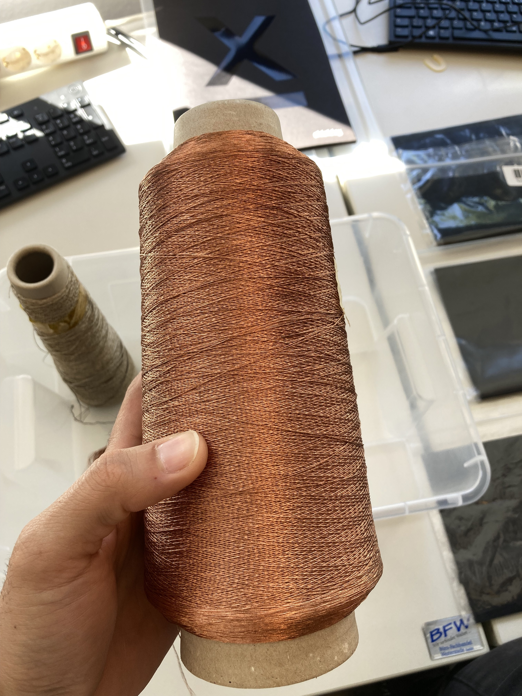 | 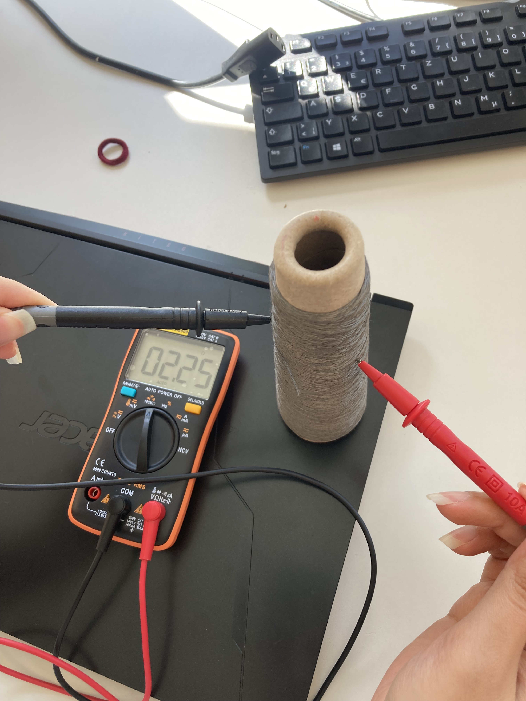 |

---

## Materials Used

- Conductive yarn
- Alternative conductive yarn with better conductivity
- Five blue LEDs with built-in resistors
- Coin cell battery
- Battery holder with two positive connections, two negative connections, and an on/off switch
- Dark blue base fabric
- Red skull-patterned top fabric
- Needle
- Non-conductive yarn
- Scissors
- Razor
- Soap for marking fabric
- Paper and pencil


| Starting materials: fabric, battery holder, LEDs, needle, and thread |               fabric                |
|:--------------------------------------------------------------------:|:-----------------------------------:|
|                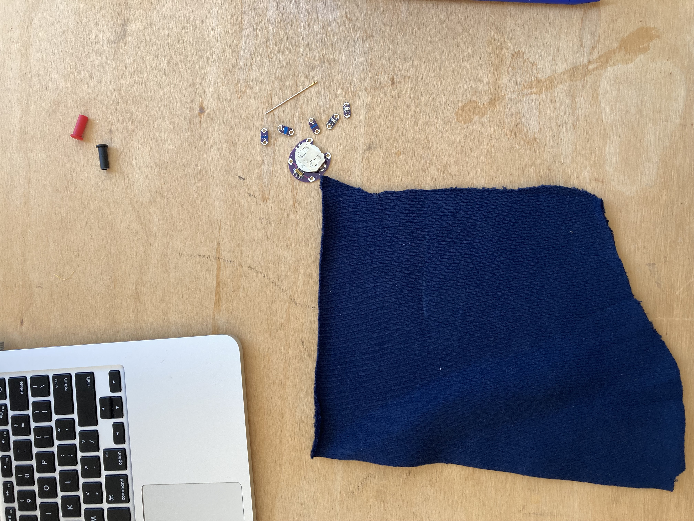                | 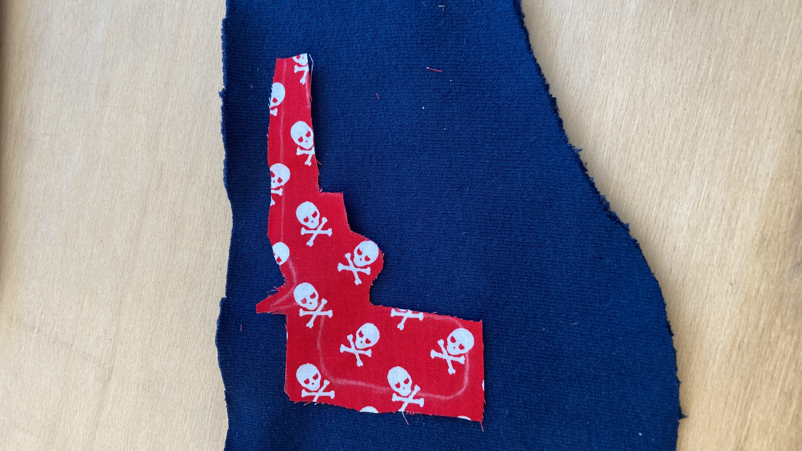 |


---

## Design Idea

After testing the conductive yarn, I wanted to make a textile object that looked visually interesting when the LEDs were switched on. I chose a revolver shape because I thought the silhouette would work well with shiny blue LEDs.

First, I drew the revolver shape on paper. Then I transferred the outline onto the fabric using soap. The soap line helped me see where to cut without permanently marking the fabric.

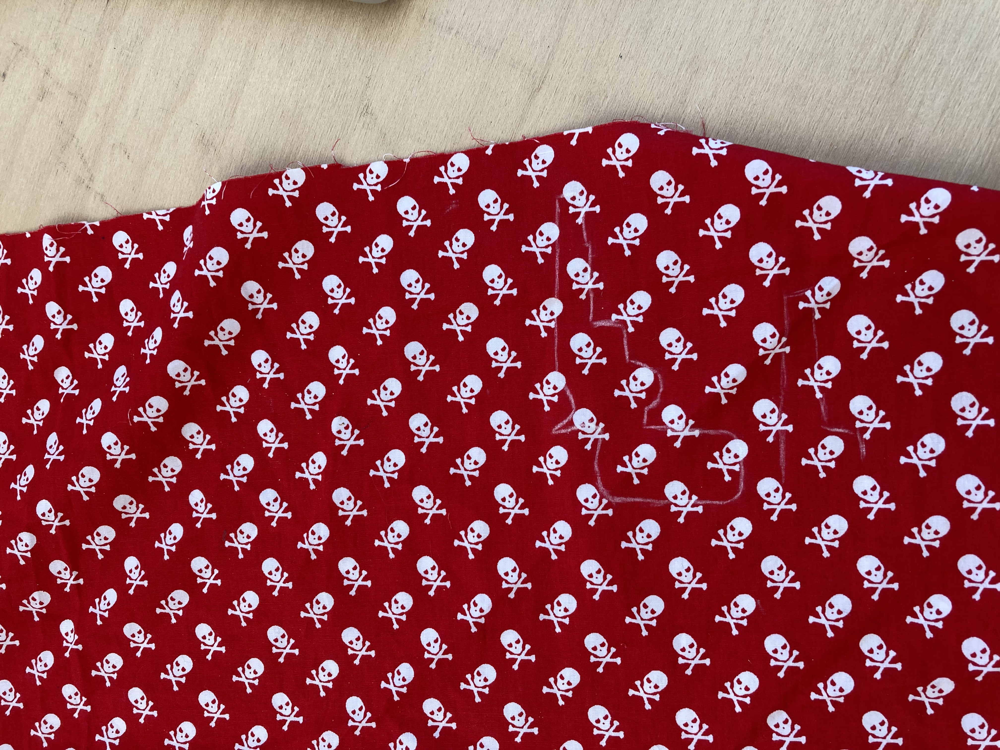

Cutting the revolver shape was one of the most difficult parts of the project because the shape had sharp corners, curves, and small details. I used scissors and a razor to cut the shape as carefully as possible.

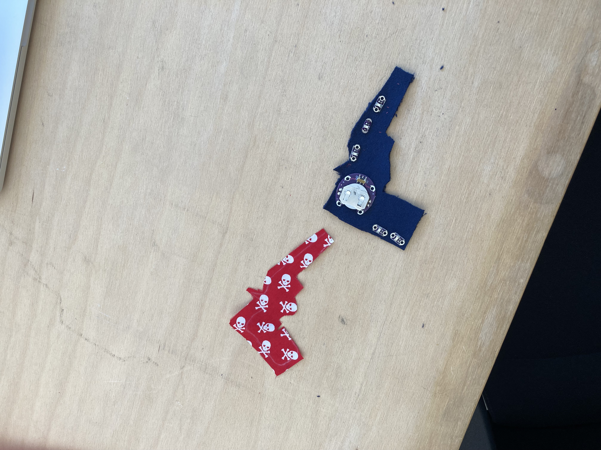

---

## Circuit Construction

I attached the coin cell battery holder to the dark blue base fabric using conductive yarn. Then I connected the circuit so that all positive LED sides were connected to the positive side of the battery holder. I also connected all negative LED sides to the negative side of the battery holder.

This created a parallel LED circuit. Because the LEDs had built-in resistors, they could be connected directly to the coin cell battery holder.


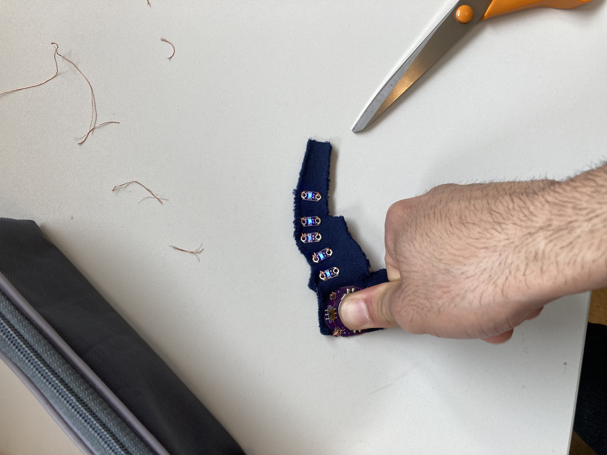

---

## Testing and Problem Solving

During testing, I found that the first conductive yarn had higher resistance than expected. Because of this, the LEDs did not work reliably. I solved this by repeating the conductive paths with a better conductive yarn.

After changing the yarn, the LEDs turned on, but only when I pressed the battery holder. This showed that the problem was not only the yarn resistance but also the contact at the battery holder. I improved the connection until the LEDs worked properly.

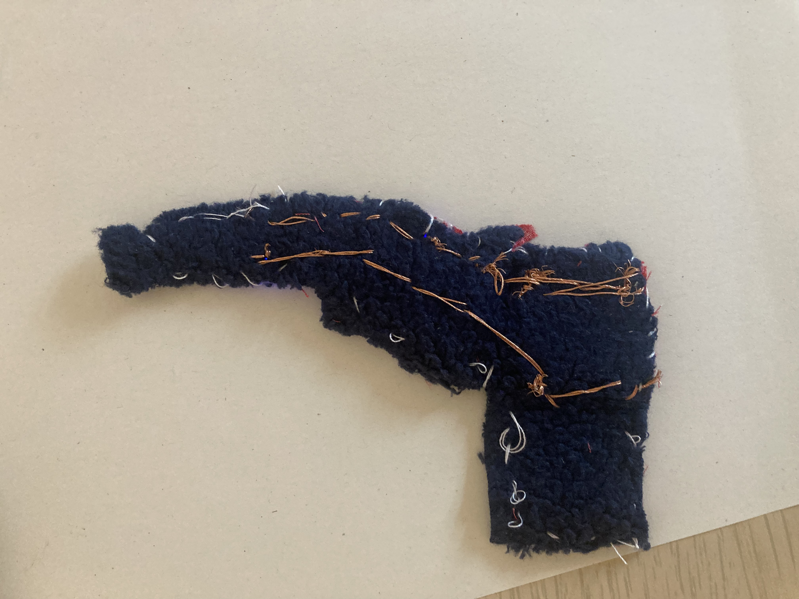

---

## Final Result

After the circuit was working, I covered the circuit with the red fabric layer and finished the textile using non-conductive yarn. I used non-conductive yarn for the finishing stitches so that the decorative sewing would not interfere with the electrical circuit.

The final result is not perfect in shape or finishing, but I like it because it shows my design idea, my testing process, and the improvements I made during the exercise.

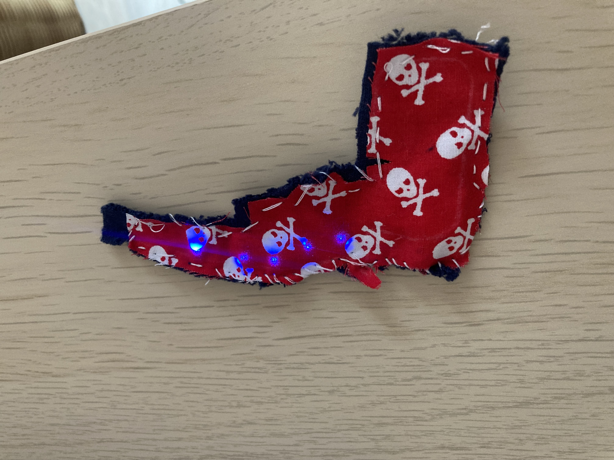

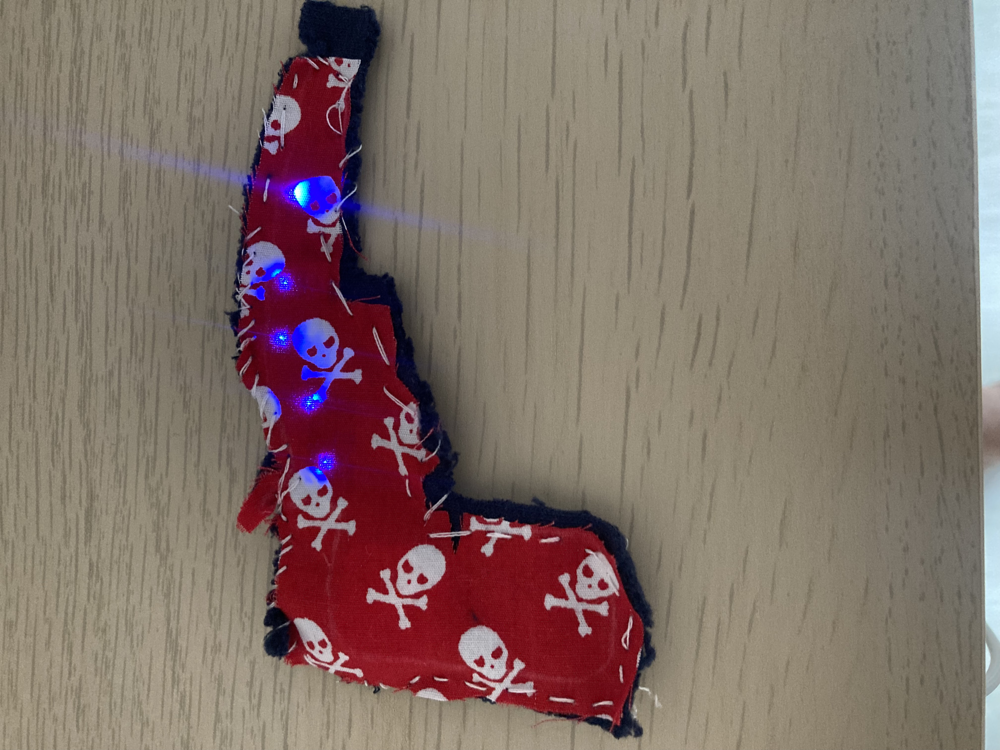

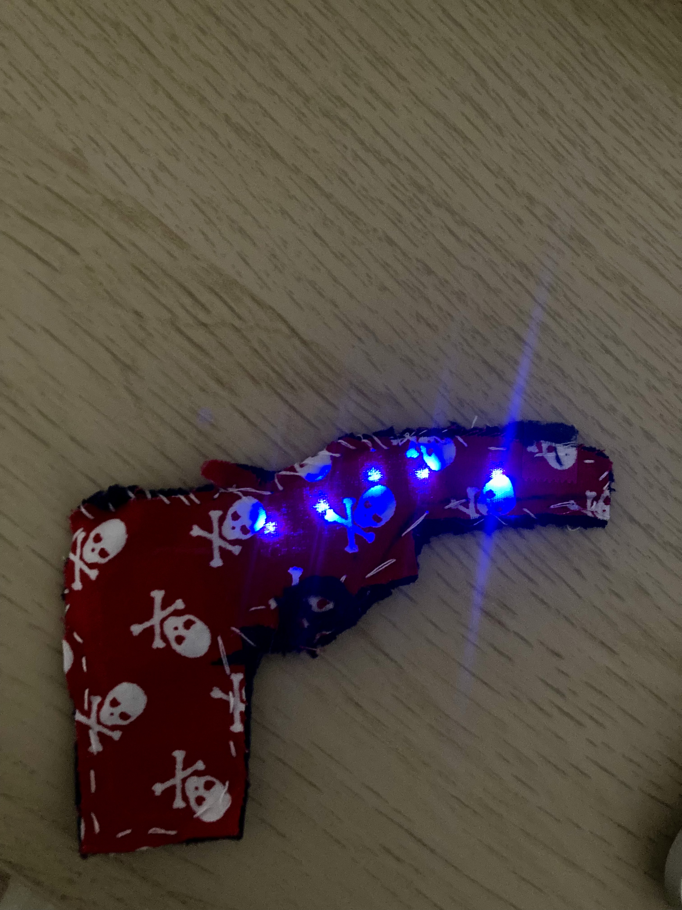

---

## Demo GIF

The GIF below shows only the main action from the video: the textile circuit being pressed and the blue LEDs lighting up.


---

## Reflection

This exercise helped me understand that e-textile circuits depend on both electronic design and material behavior. In a normal circuit, wires usually have very low resistance, but in e-textiles the conductive yarn can have enough resistance to affect the brightness and reliability of LEDs.

I also learned that contact points are very important. Even when the circuit layout is correct, a weak connection at the battery holder can prevent the LEDs from working. Testing with a multimeter and checking the circuit step by step helped me identify the problem.

The most challenging parts were cutting the revolver shape, stitching the conductive paths neatly, and making stable connections between the battery holder and the LEDs. If I repeated the project, I would plan the circuit paths more clearly before sewing, choose wider conductive paths, and allow more space between the positive and negative lines. This would make the circuit easier to handle, reduce the risk of accidental short circuits, and help me make the finishing stitches cleaner and more reliable.

---

## Conclusion

I successfully created an e-textile LED circuit inspired by the shape of a revolver. The project included measuring conductive yarn resistance, choosing suitable materials, designing and cutting fabric, sewing a parallel LED circuit, testing the circuit, solving conductivity and contact problems, and finishing the textile with a top fabric layer.

The final object demonstrates the main learning points of the exercise: conductivity, resistance, polarity, circuit testing, and the practical challenges of working with electronic textiles.

---

# Exercise 5: CNC Milling

## Wooden Tea Light Candle Holder Design

This portfolio documents my CNC milling exercise, where I designed a wooden tea light candle holder in Inkscape and prepared it as a clean SVG/vector file for the CNC workflow. The design was based on a simplified leaf shape, with a circular candle pocket placed in the center.

---

## Inspiration and Final Vector Drawing

I used the Canadian flag image only as a visual reference for the leaf shape. The final drawing was created separately as my own simplified vector outline, without keeping the flag image in the final file.

|                    Inspiration image                    |                Final vector drawing without the flag image                |
|:-------------------------------------------------------:|:-------------------------------------------------------------------------:|
|  | 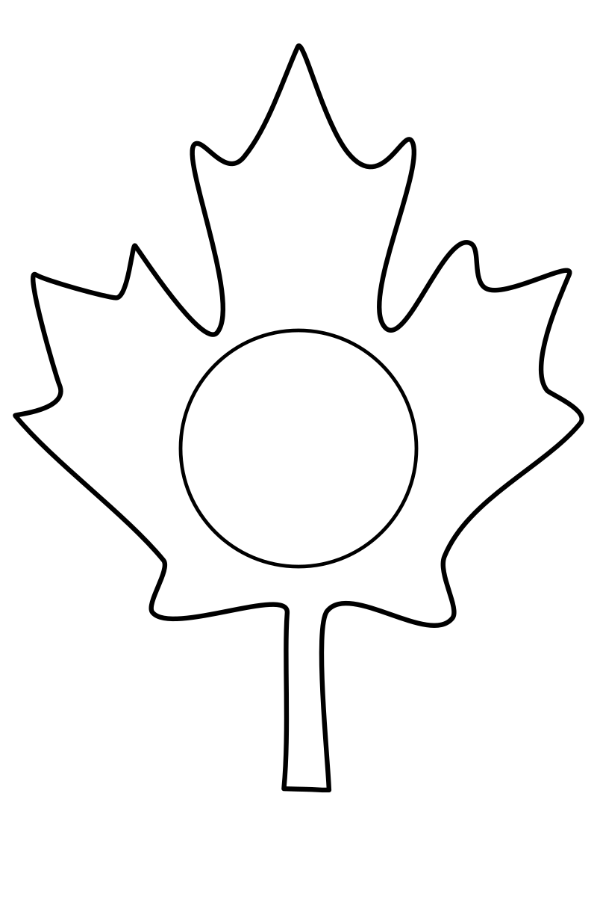 |

---

## Design Idea and Change of Plan

At the beginning, I installed Inkscape and planned to use a lily pad picture as my design inspiration. After looking at it more carefully, I realized that the lily pad shape had too many sharp edges and small details. These details could make the drawing harder to clean and could also be difficult to mill accurately.

Because of this, I changed my idea and chose a leaf shape inspired by the Canadian flag. I thought the leaf would look good as a wooden candle holder because it is recognizable, decorative, and suitable for a natural wood object. I used the flag image only as a visual reference and created my own simplified vector outline for CNC milling.

---

## Document Preparation in Inkscape

I set the Inkscape page according to the exercise requirements. The page was prepared at 100 mm by 150 mm, and the units were set to millimeters so the drawing would have real physical dimensions for machining. I also created the candle pocket as a 39.5 mm circle and saved the finished design as an SVG vector file.

---

## Drawing Process

First, I drew the 39.5 mm circle for the candle hole and placed it exactly in the middle of the page. Then I imported the Canadian flag image and used the leaf only as a reference for my own drawing.

To make tracing easier, I opened **Layers and Objects** from the task bar, moved the reference image to a lower layer, and locked it so it stayed fixed on the page. This followed the workflow explained in the manual.

After that, I used the Pen tool to create a simple vector outline around the leaf shape using **Bézier curves**. This allowed me to build my own clean path instead of using the image directly. I made the stroke a little thicker so the outline was easier to see, and then used the Node tool to polish the shape.

During the editing process, I added and removed some nodes to improve the drawing. I corrected the curves, adjusted the path, and removed unnecessary points where the outline was too detailed. These changes made the final leaf cleaner, smoother, and more suitable for CNC machining.

Finally, I placed the leaf outline in the middle of the page around the candle hole. With the tutor’s explanation, I also realized that the stem of the leaf needed to be at least 6 mm wide, so it would be strong enough and would not break during milling or afterwards. When the drawing was finished, I saved it as an `.svg` file.

---

## CNC Milling Considerations

After receiving feedback from the tutor, I realized that some parts of my first design were not strong enough for CNC milling. The tutor explained that the stem of the leaf should not be too thin, because it could break during the milling process or afterwards when handling the wooden candle holder.

Based on this feedback, I changed the design and increased the stem width to about 6 mm. I also simplified the leaf outline and cleaned the vector path to make the shape more suitable for machining. This change made the final drawing stronger, easier to understand in CAM, and more realistic for CNC milling.

---

## CNC Machine Work During Class

During class, I took photos and videos of the CNC machine working. These photos and GIFs show how the digital design was connected to the real milling process.

From observing the machine, I understood that the CNC milling process is controlled through different parts. The machine had a remote control for manual movement, and it was also connected to a computer system with a mouse and screen. The screen showed the configuration, the machining process, and the position of the milling path.

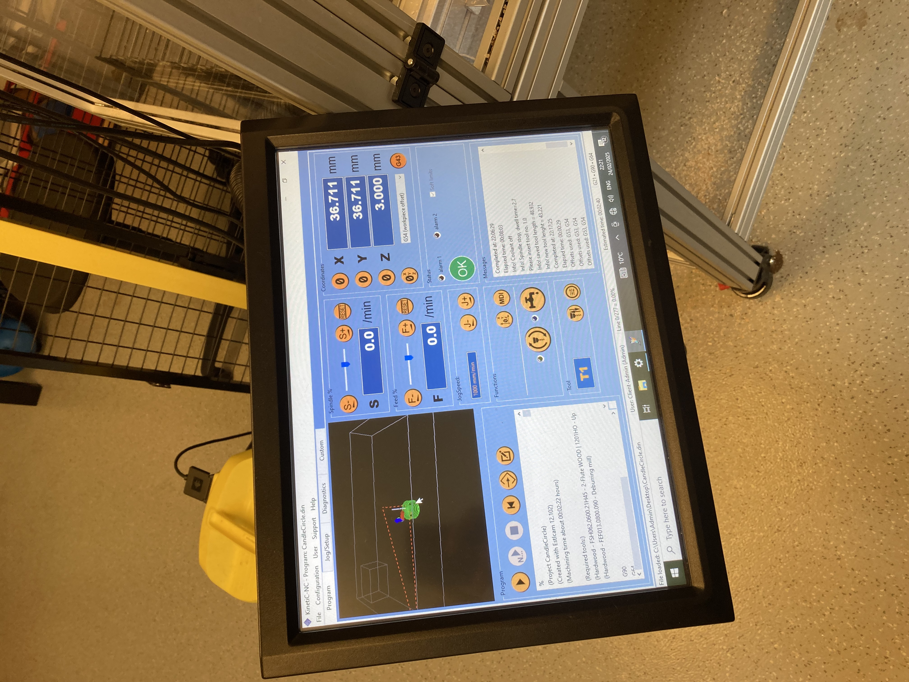

**Observation:** The control screen showed the CNC program, toolpath preview, machine status, and coordinate values. This helped us understand where the machine was moving and how the milling process was being monitored.

Before milling started, the base vector and the X, Y, and Z directions were checked. This helped show where the machine would move and where the starting point was located. The starting position was also shown on the computer screen as a box, which helped make sure the milling head was aligned with the correct point.

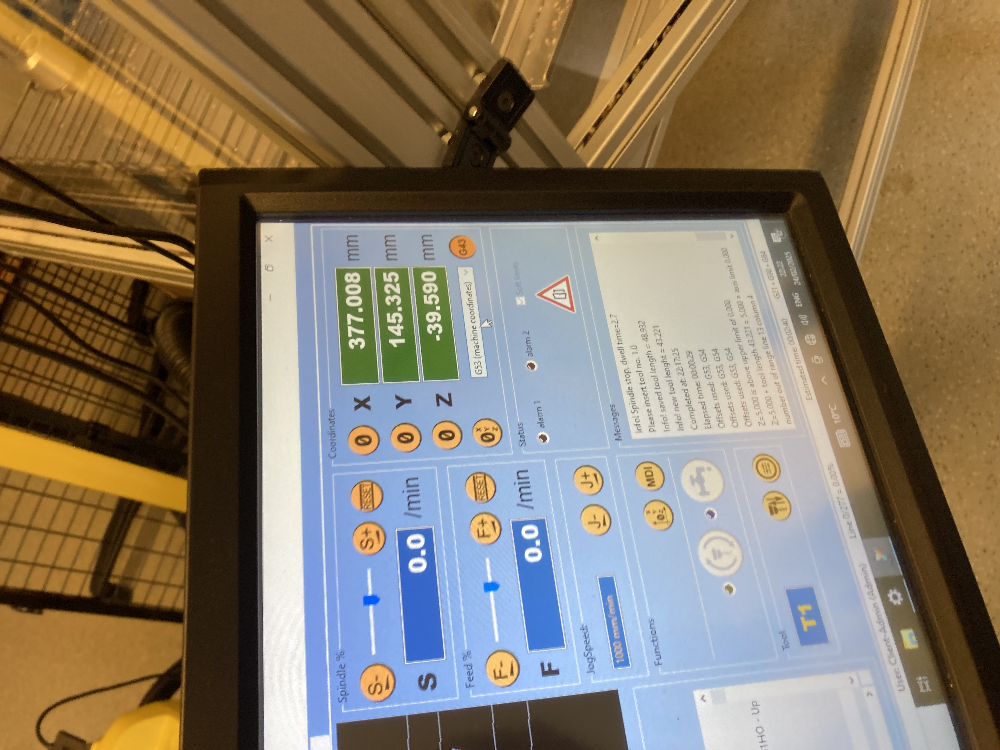

To set the Z height, we used a piece of paper on top of the wooden workpiece. The milling head was moved carefully down until it touched the paper. This helped check that the Z position was correct before the real milling process started.

During milling, the CNC machine used an internal vacuum system to clean the working area and remove dust and small wood particles. We also used ear protection because the machine was loud while cutting the wood.

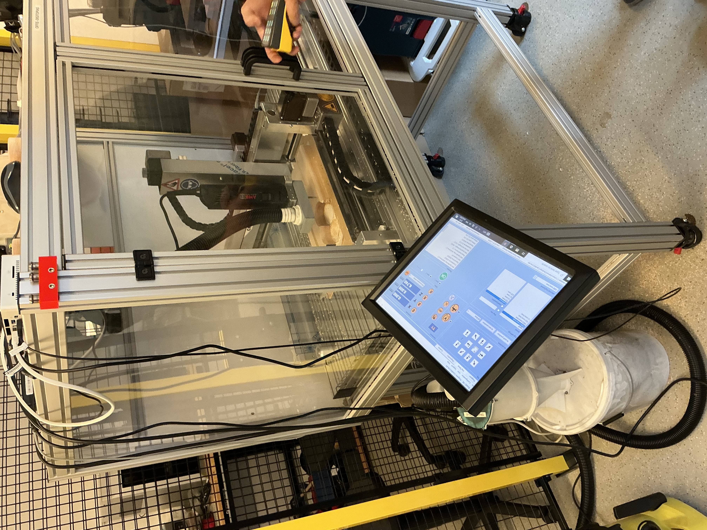

After the outside shape was milled, the milling head/blade was changed. The second tool was used for milling the inside pocket of the candle hole.

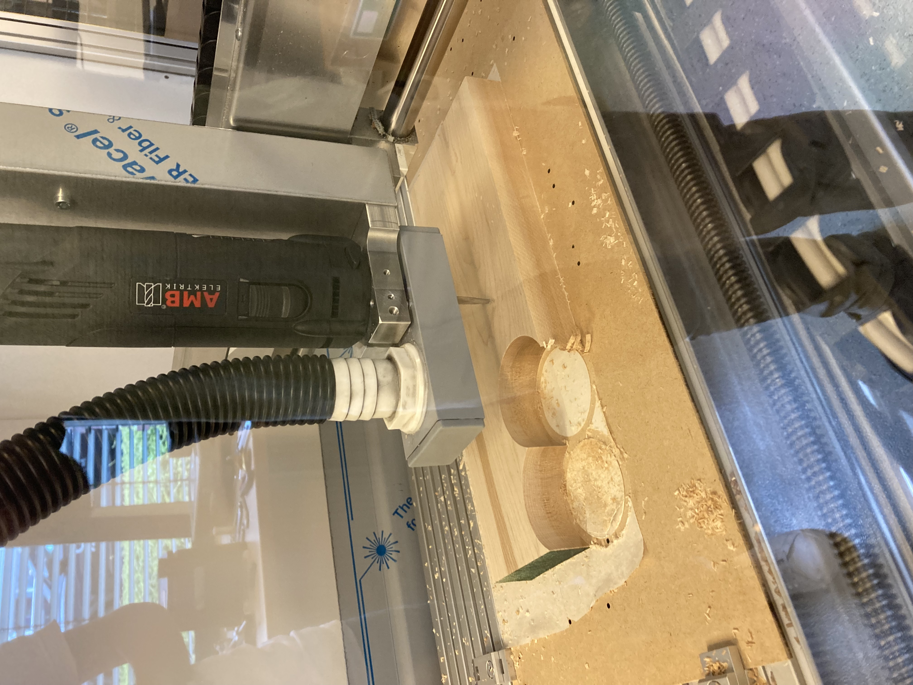

When the process was finished, we removed the wooden candle holder carefully with a small movement.

---

## CNC Process GIFs

The GIFs below show the CNC machine working during the class. They make it easier to show the movement of the milling head and the machining process inside the machine enclosure.

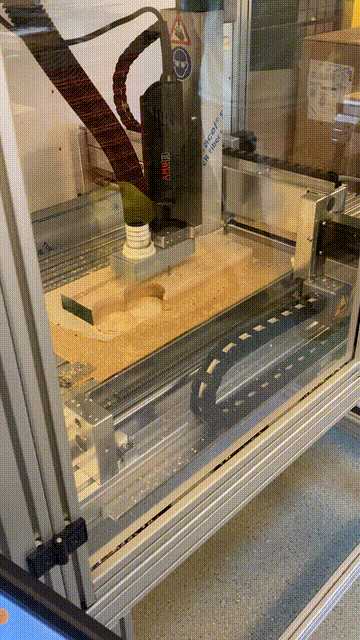

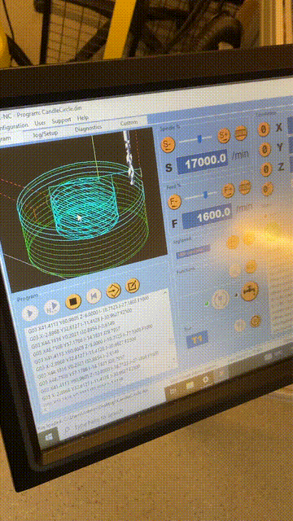

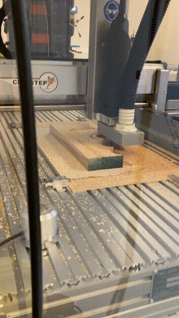

---


## Final CNC Milling Outcome

After the CNC milling process was finished, I tested the final wooden candle holder with a tea light candle. The final object shows that the digital vector drawing was successfully transformed into a real wooden product.

The circular pocket in the middle fits the tea light candle well, and the raised edge around the hole helps keep the candle in place. The simplified leaf shape also worked well for CNC milling, because the outline was clear and the stem was strong enough after increasing its width.

| Final candle holder with candle | Side view with candle |
|:-------------------------------:|:---------------------:|
| 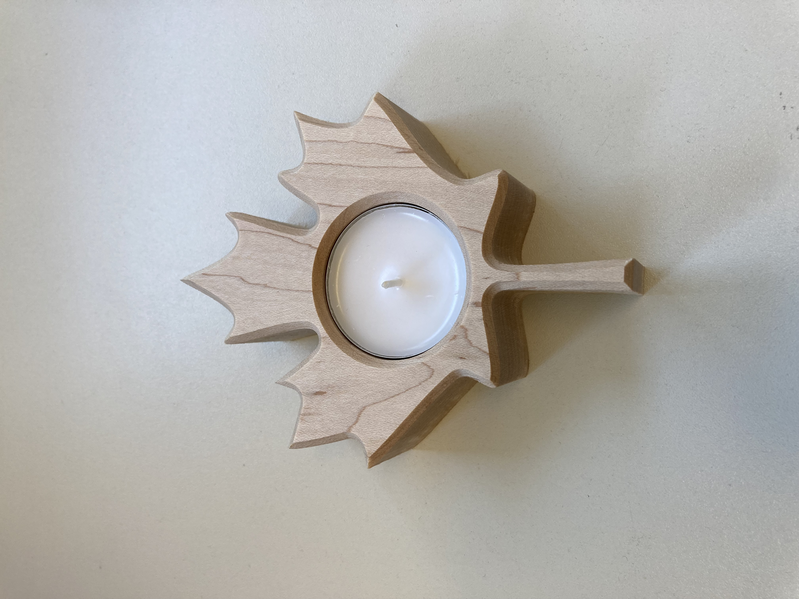 | 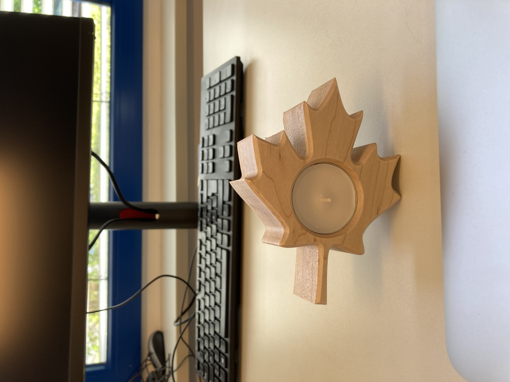 |

The photos below show the final result without the candle. This makes it easier to see the milled candle pocket, the wood grain, the depth of the cut, and the finished leaf shape.

| Final result without candle | Back and side detail |
|:---------------------------:|:--------------------:|
| 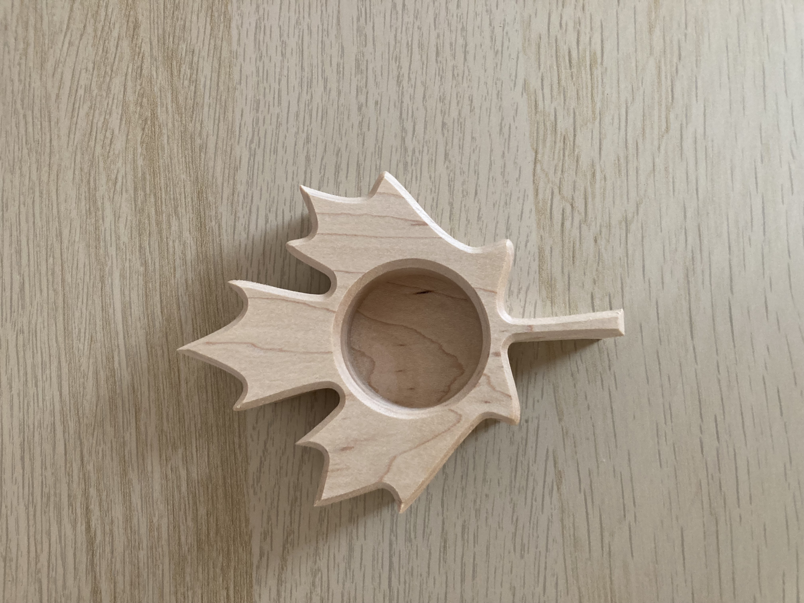 | 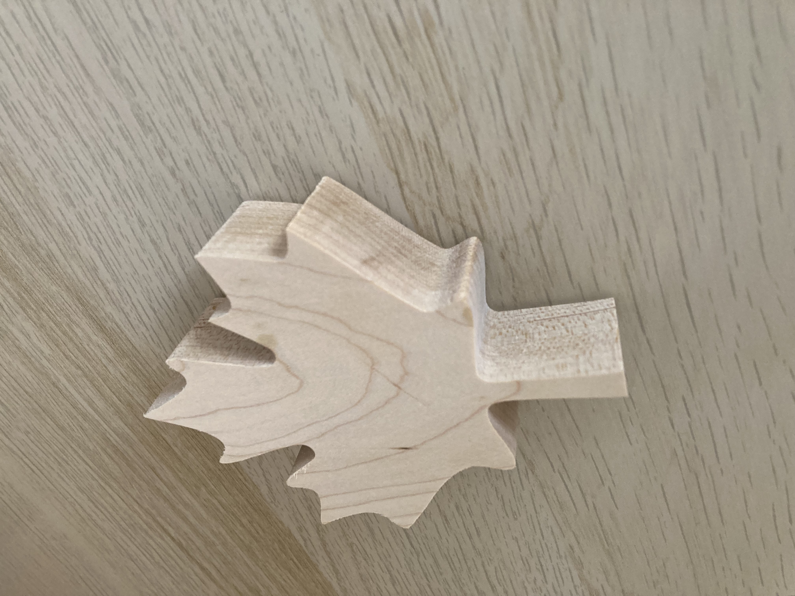 |
---
## Learning Outcome

This exercise helped me understand how a simple idea becomes a real object through CNC milling. I learned that the drawing must be clean, correctly sized, and suitable for the milling tool. I also learned that design decisions are not only visual; they must also consider material strength and machining limits.

The most useful part was watching the CNC machine during class. It helped me understand how the CAD drawing and CAM toolpaths become a physical wooden candle holder.

---

## Conclusion

I successfully created a CNC milling design for a wooden tea light candle holder. The project included choosing and changing the design idea, preparing the Inkscape document, creating a clean vector outline with Bézier curves, adjusting nodes, considering material strength, and observing the CNC milling process during class.

The final result demonstrates the main learning points of the exercise: vector drawing, CNC design constraints, CAM preparation, machine setup, tool movement, and the connection between digital design and physical fabrication.

---
 # Exercise 6: Laser Cutting & Engraving

## Project Overview

For this exercise, I designed and fabricated a transparent acrylic business-card sample with an **Epilog Laser Fusion 60 W** CO₂ laser cutter. My final card combined a portrait line-art image, text, a vertical slogan, decorative border paths, raster engraving, and vector cutting. The work was not only about making the card; it was also about understanding the full workflow from design preparation to machine setup and final evaluation.

The main idea was to make a small acrylic card that shows how transparent material reacts to laser engraving. Because acrylic is clear, I also needed to think about contrast, readability, and how the final piece looks on a dark background.

---

## Design Preparation

### Preparing the portrait for engraving

I started by preparing my portrait as a clean black-and-white line-art image. I wanted the portrait to be simple enough for the laser to engrave clearly, but still detailed enough to be recognizable. Since the card was small, I avoided using a very complex photo and used a line-art style instead.


### 1. Designing the card layout in Inkscape

After preparing the portrait, I designed the complete card in Inkscape. I set the card size to **85 mm × 55 mm**, which is similar to a standard business card size. I placed the name and contact information on the left side, added the portrait under the name, placed the slogan **“Time is Money”** vertically on the right side, and used decorative spiral borders on the bottom and right side.

At this stage, I was mainly arranging the design and checking that every element had enough space. I also made sure the important text was not too small, because very small engraved text on transparent acrylic can become hard to read.

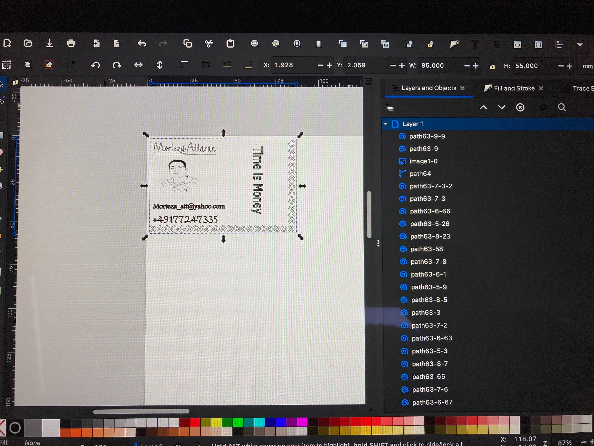

### 2. Checking stroke settings for cutting and engraving

Before sending the file to the laser cutter, I checked the stroke settings in Inkscape. For the **vector cutting lines**, I used a very thin stroke width of **0.001 mm**. This is important because the laser driver recognizes very thin hairline paths as vector cut lines.

For the engraving parts, such as the portrait, text, and decorative details, I kept them as visible black artwork/fill or normal visible paths so the laser could treat them as raster engraving. In my understanding, engraving and cutting are handled differently: engraving scans the surface area and removes a shallow layer from the acrylic, while cutting follows the vector line to go through the material.

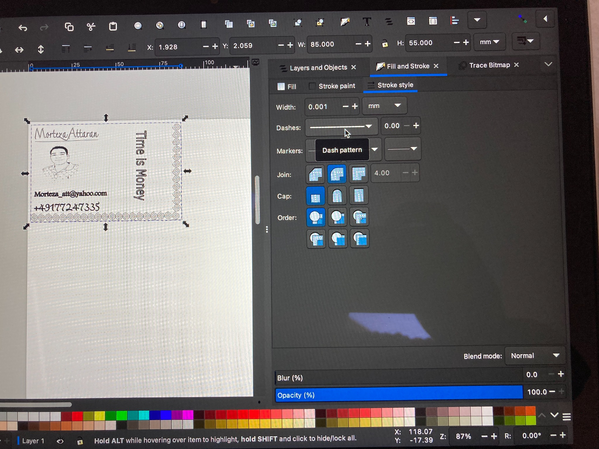

---

## Preparing the Material and Laser Job

### 3. Measuring the acrylic thickness

After finishing the digital design, I measured the acrylic sheet with a digital caliper. I did this before the laser job because the material thickness affects the cutting settings. If the thickness is not checked properly, the laser may not cut through the acrylic completely, or it may use too much power and leave rough edges.

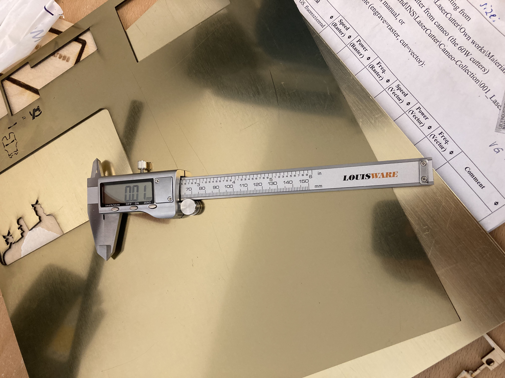

### 4. Sending the file through the Epilog driver

Then I opened the print/laser driver settings. In the Epilog driver, I checked that the job was prepared as a combined workflow for both raster engraving and vector cutting. I also checked the resolution and the laser settings before sending the job.

In this step, I learned that the software settings are just as important as the design itself. Even if the Inkscape file looks correct, the result can fail if the driver settings, page size, or laser mode are not set correctly.

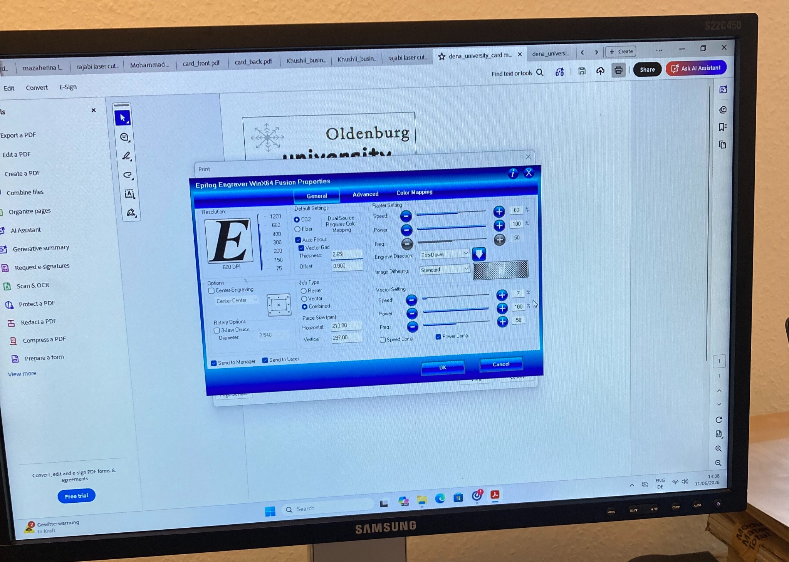

### 5. Placing the acrylic on the laser bed

After the file was ready, I placed the acrylic sheet on the honeycomb laser bed. I positioned it carefully so the card would be cut in the correct area of the material. I also checked the position of the laser head and made sure the material was flat on the bed.

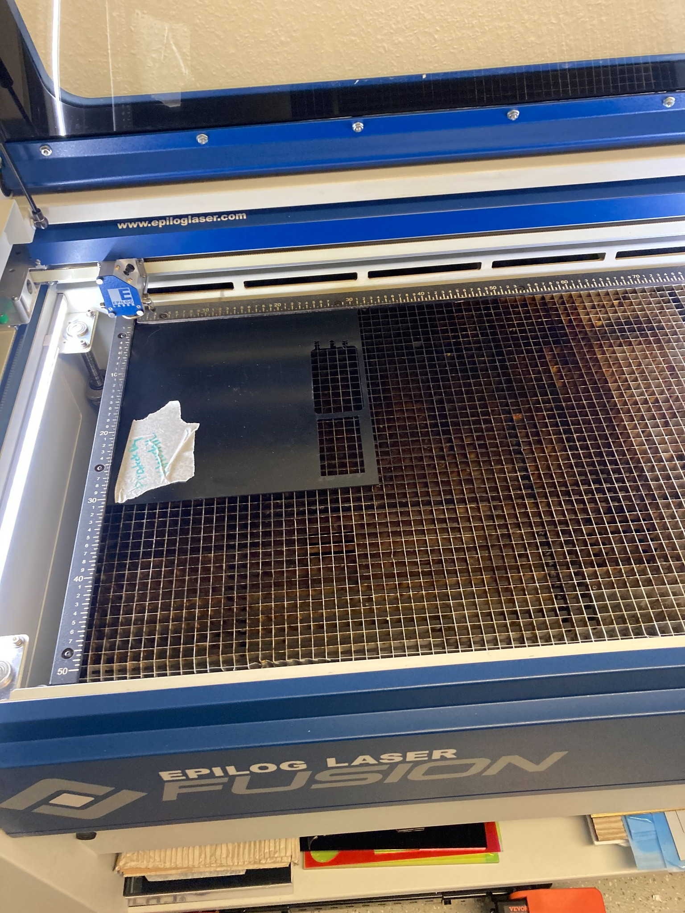

At this point, I also paid attention to the **manual starting point/origin**. The starting point had to be set properly before running the job, because the laser follows the design based on the selected origin. If the origin is wrong, the laser could start in the wrong place and waste the acrylic sheet.

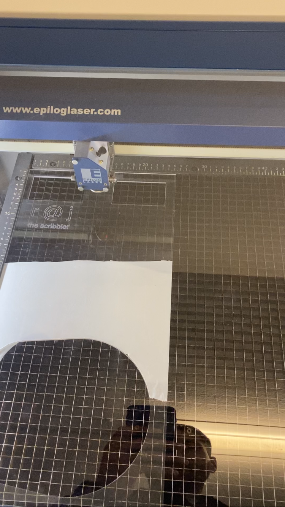

### 6. Checking the machine area before starting

Before pressing start, I checked the control panel, emergency stop button, machine side, and workstation area. I also made sure the BOFA fume extraction system was running, because acrylic cutting and engraving produce fumes and odor. The machine cover stayed closed during operation for safety.

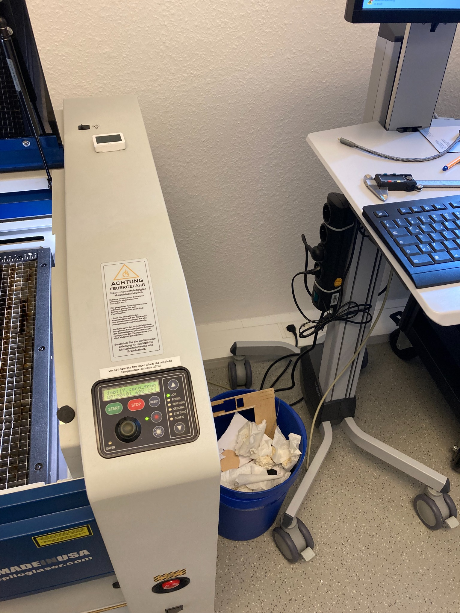

---

## Laser Cutting and Engraving Process

### 7. Cutting action

After setting the starting point and checking the material position, I started the job. The cutting action followed the vector paths and moved along the outline of the design. Cutting was faster than engraving because the laser only needed to follow the vector line instead of scanning a whole filled area.

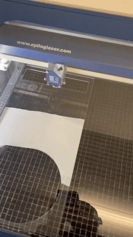

### 8. Engraving action

The engraving part took more time than the cutting part. This made sense to me because engraving works by scanning back and forth over the artwork, especially for the portrait, text, and decorative details. The laser has to cover a larger surface area during raster engraving, while cutting only follows thin vector lines.

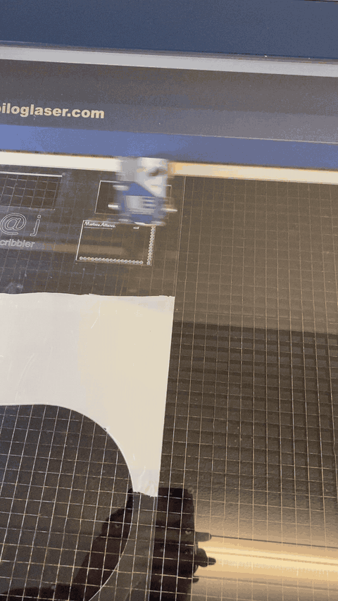

---

## Final Result

### 9. First check of the acrylic card

After the laser job finished, I removed the acrylic card and checked the result by holding it in my hand. The engraved lines appeared white on the transparent surface, but because the acrylic was clear, the details were easier to see when I placed the card against a darker background.

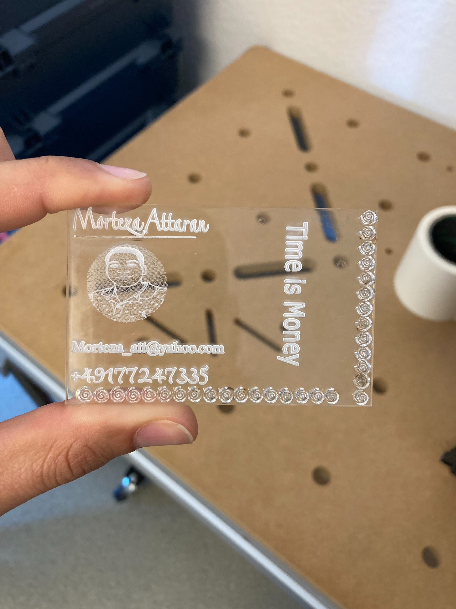

### 10. Checking the final card on a dark background

I then placed the card on a dark surface to evaluate the engraving contrast. This made the portrait, text, border, and slogan much clearer. This step helped me understand that transparent acrylic often needs a background behind it to make engraved details more visible.

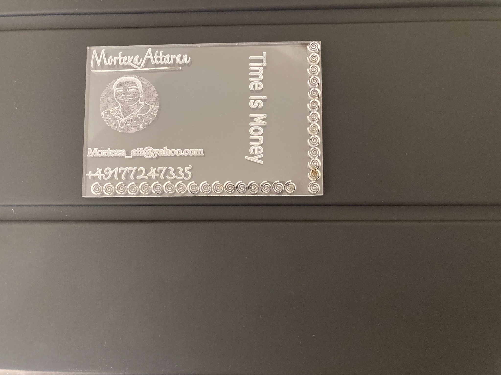

### 11. Final machine view after the workflow

At the end, I documented the full machine setup again. The Epilog Laser Fusion, BOFA extractor, and workstation were all part of the final workflow. This photo shows the complete working environment that connected the digital design process to the physical fabrication result.

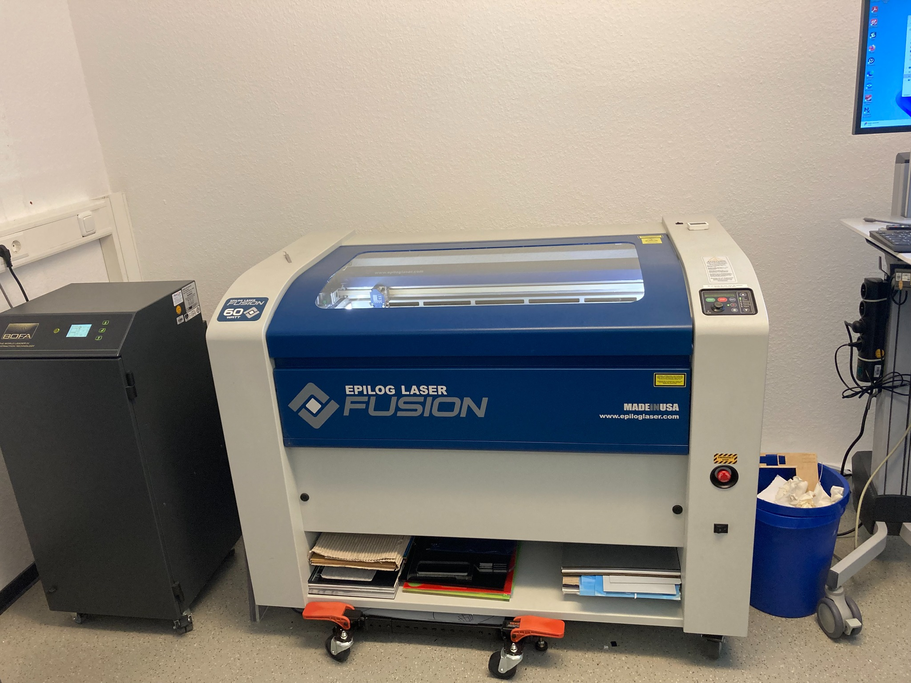

---

## Problems and Improvements

One challenge was making the engraving readable on transparent acrylic. The portrait, small text, and decorative borders needed enough contrast, but the material itself was clear. I solved this by checking the result on a dark background and by keeping the layout simple enough to read.

Another challenge was preparing the file correctly for both engraving and cutting. I had to separate in my mind what should be engraved and what should be cut. The cutting lines needed a **0.001 mm stroke**, while the engraving artwork needed to remain visible as raster content. I also learned that the start point/origin must be set manually and carefully, because a wrong starting point can shift the whole job.

---

## Learning Outcome

This exercise helped me understand the full laser-cutting workflow more clearly. I learned that the final result depends on several connected steps: preparing the design in Inkscape, setting the correct stroke width for vector cutting, measuring the acrylic, checking the driver settings, setting the manual origin, using the fume extractor, and comparing the cutting and engraving behavior.

The most important observation for me was that engraving takes noticeably longer than cutting. Cutting follows a line, but engraving scans an area. This made the difference between vector and raster work much easier to understand.

---

## Conclusion

I successfully designed, engraved, and cut a transparent acrylic business-card sample using the Epilog Laser Fusion 60 W. The project started with portrait preparation and Inkscape layout design, continued with stroke checking, material measurement, driver setup, manual starting point adjustment, laser cutting, and engraving, and finished with checking the final acrylic card on different backgrounds.

The final piece shows the main learning points of the exercise: raster engraving, vector cutting, thin cutting strokes, material positioning, manual origin setting, fume extraction, and the connection between digital design and physical fabrication.

---
# Onshape CAD Training Portfolio

## Completed Training

I completed the required Onshape Introduction to CAD training courses:

- Introduction to Parametric Feature-Based CAD
- Introduction to Sketching
- Introduction to Part Studios

## Proof of Completion

The screenshot below shows my Onshape Training Dashboard with **3 completed courses** and **3 certifications**.


## Short Reflection

Through this training, I learned the basics of parametric CAD, sketching, constraints, features, and creating 3D parts in Onshape.

---

# Exercise 7: 3D Printing

## Custom Phone and Tablet Stand

This portfolio documents my 3D printing exercise, where I designed a custom phone and tablet stand using **Onshape** for parametric CAD modelling and **QIDI Studio** for slicing. Instead of simply downloading and printing an existing model, I used an existing stand only as inspiration and then recreated my own version from scratch.

The final model was designed as a single parametric part that could be manufactured as one 3D-printed component, with integrated cable management and a personal cut-out signature.

---

## Inspiration

Before starting the CAD model, I looked at an existing printed phone and tablet stand and also checked its 3D model. I used these references to understand the basic geometry, viewing angle, and support idea. However, I did not copy the model directly. I redesigned the stand in Onshape with my own dimensions and added my own functional and personal details.

|                Printed inspiration stand                |                    Reference 3D model                     |
|:-------------------------------------------------------:|:---------------------------------------------------------:|
| 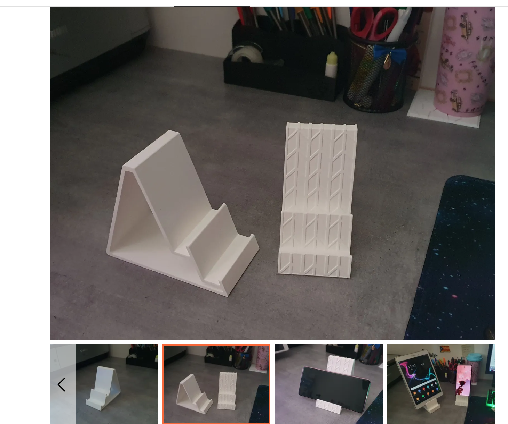 | 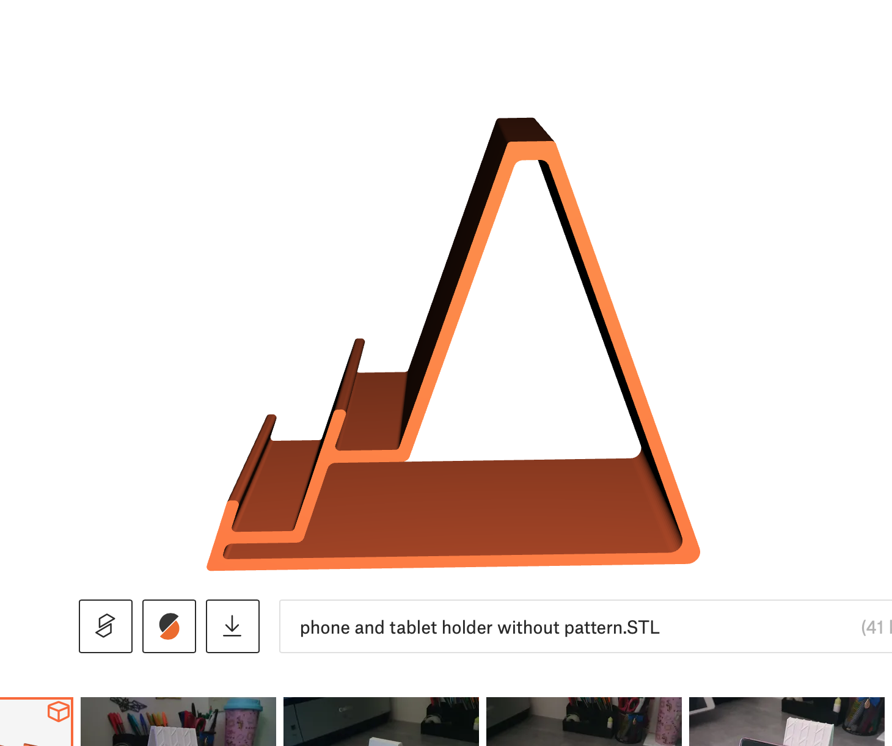 |

---

## Design Idea

The goal was to create a practical desk accessory that can hold a phone or tablet at a comfortable viewing angle. I also wanted the device to be usable while charging, so I planned a cable opening as part of the design.

The stand was designed to:

- support both smartphones and tablets,
- work as a stable single printed part,
- include a charging cable opening,
- be lightweight and portable,
- provide a simple, stable, and aesthetically pleasing design,
- use fully defined parametric sketches,
- include a personal **M.T.Z.** cut-out signature.

---

## Creating the Main Profile Sketch

I started by creating the main side profile sketch of the stand in Onshape. This sketch defined the overall shape, the support angle, and the main proportions of the model. I used dimensions and constraints to control the sketch instead of only drawing it freely.

One important part of this step was making the sketch fully defined. I attached the geometry to the main reference point and added the required dimensions and angles so the sketch would behave predictably if changed later.

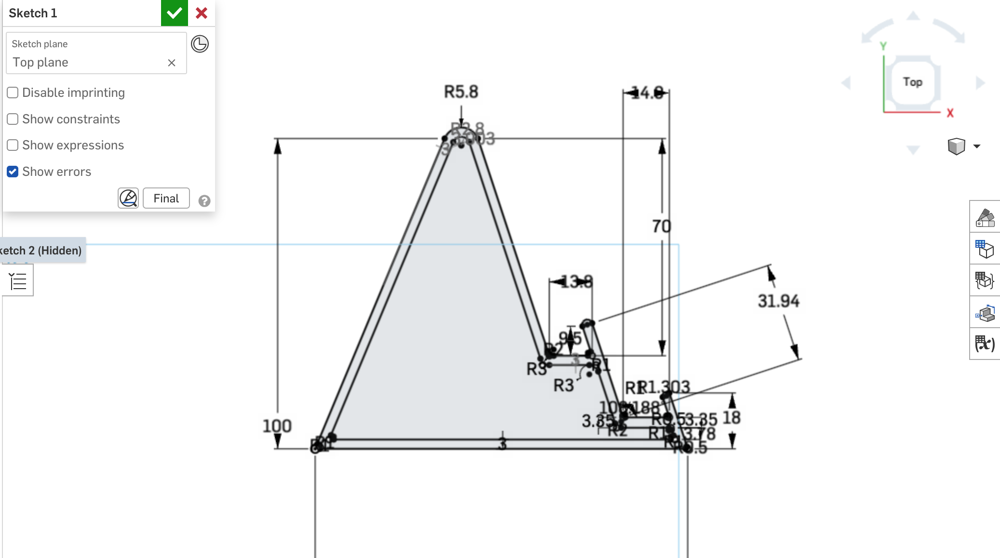

---

## From Sketch to Solid Body

After defining the main profile, I used **Extrude** to turn the sketch into a three-dimensional part. This created the first main body of the stand.

I then continued refining the shape with additional modelling steps. The design gradually changed from a simple extruded profile into a more complete holder with functional details.

While developing the model, I did not simply create the final shape in one step. I also extruded several intermediate sketches from the original part to better understand the real geometry of the stand and evaluate how different dimensions affected its stability and appearance. This iterative approach helped me refine the final design before completing the model.

|                    First extruded sketch                    |                    Main extruded body                    |
|:-----------------------------------------------------------:|:--------------------------------------------------------:|
| 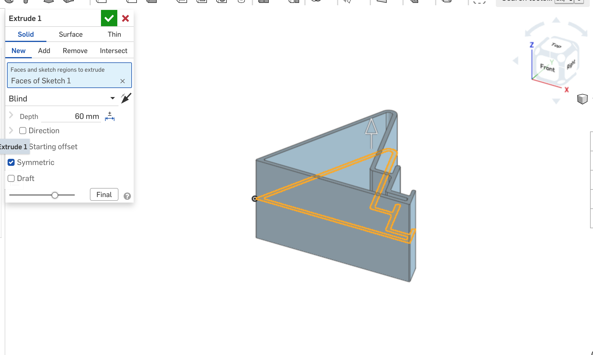 | 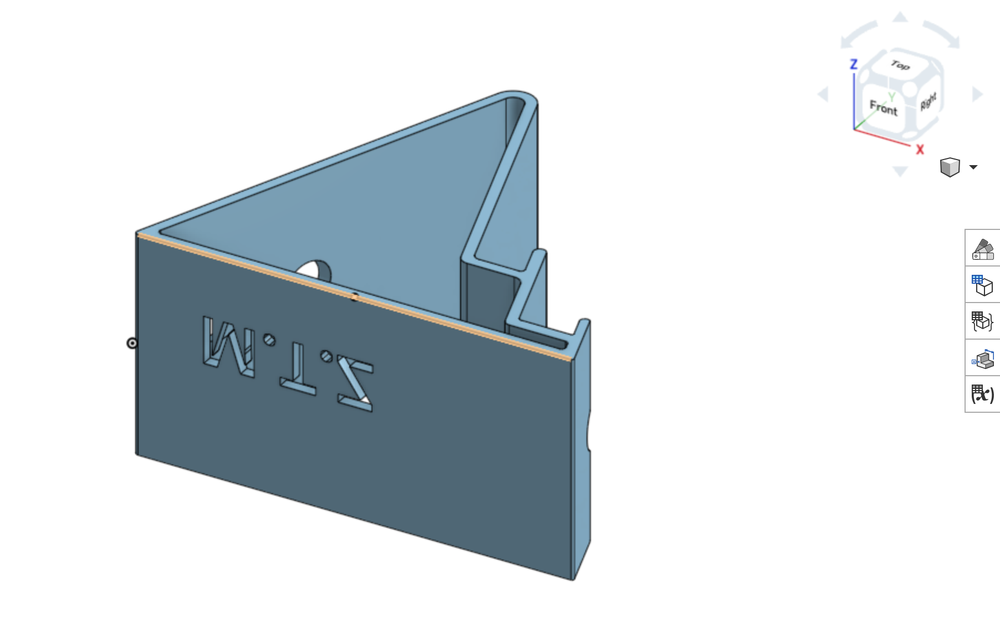 |

---

## Cable Management Opening

To make the stand more useful, I added a cable opening. This allows a charging cable to pass through the stand while the phone or tablet is resting on it. This was important because the charging socket is usually at the bottom of the device.

The cable opening was created with a separate sketch and then removed from the solid body.

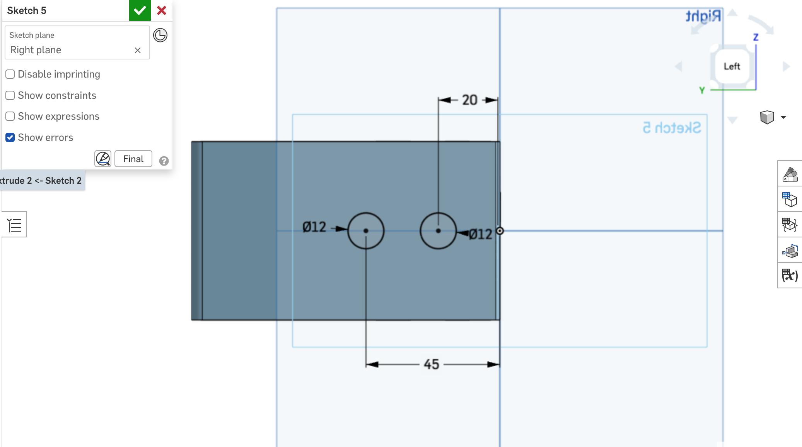

---

## Personal  signature

As a personal detail, I added my initials "**M.T.Z**" to the model. I created the letters as sketch geometry and then used **Extrude Remove** to cut the text completely through the part.

In my understanding, this is not engraving. It is more like a cut-out, because the material is removed through the body. During modelling, the signature appears on a side-oriented face, but after printing and placing the stand in its normal position, this feature belongs to the bottom/side support area of the holder.

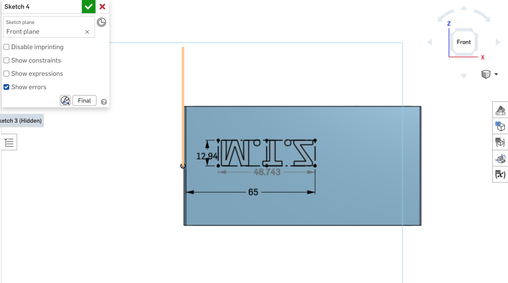

---

## Preparing the Model in QIDI Studio

After completing the CAD model, I exported the design as an STL file and imported it into **QIDI Studio** for slicing. During this stage, I selected the **QIDI Q2** printer profile and positioned the model on the build plate.

Before starting the actual print, I carefully inspected the sliced layers generated by QIDI Studio. This preview allowed me to understand how the printer would build the object layer by layer and served as a useful simulation of the printing process. It also helped me verify that the first layers had good contact with the build plate before manufacturing the real object.

During slicing, QIDI Studio reported unsupported regions in the model. To solve this problem, I enabled **Tree Supports**, which provide the required support while using less material and making post-processing easier than traditional supports.

The model was finally positioned so that its base rested securely on the print bed, improving stability during printing and reducing unnecessary support material.

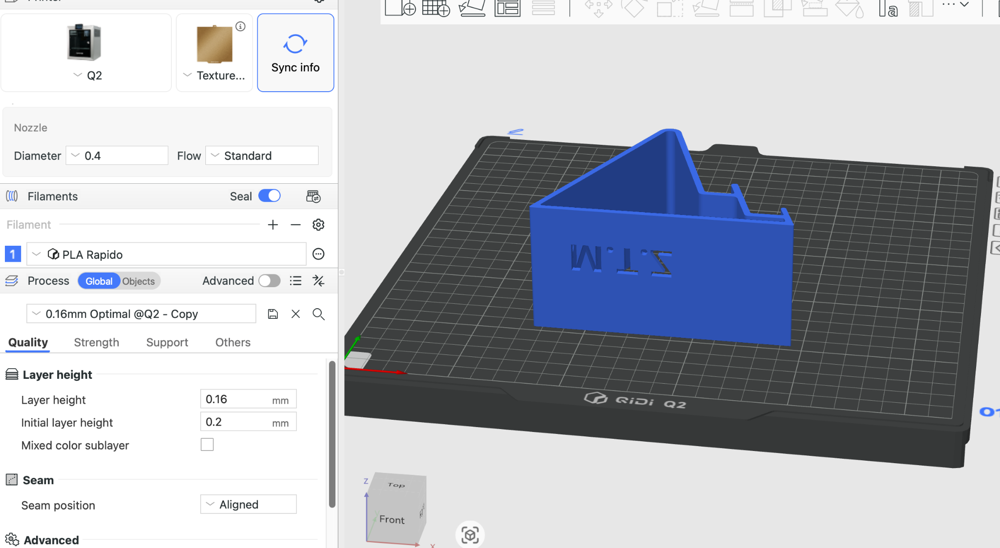

---

## Print Settings and Estimated Result

QIDI Studio was also used to estimate the printing time, filament consumption, and material weight before starting the print. The exercise required that the total material usage should not exceed **120 g**, and my final model satisfied this requirement.

One interesting observation was that the part weight reported by **Onshape** was different from the weight estimated by **QIDI Studio**. This is expected because the two programs calculate weight differently.

Onshape estimates the weight of the complete solid model using the selected material properties, while QIDI Studio estimates only the amount of filament that will actually be extruded during printing. The slicer also considers the selected material, nozzle diameter, layer height, wall thickness, infill, support structures, and other printing parameters. As a result, the estimated print weight differs from the theoretical CAD weight.

This comparison helped me understand that preparing a model for additive manufacturing involves much more than creating a CAD model. The final printed object depends on both the design itself and the manufacturing parameters chosen in the slicer.

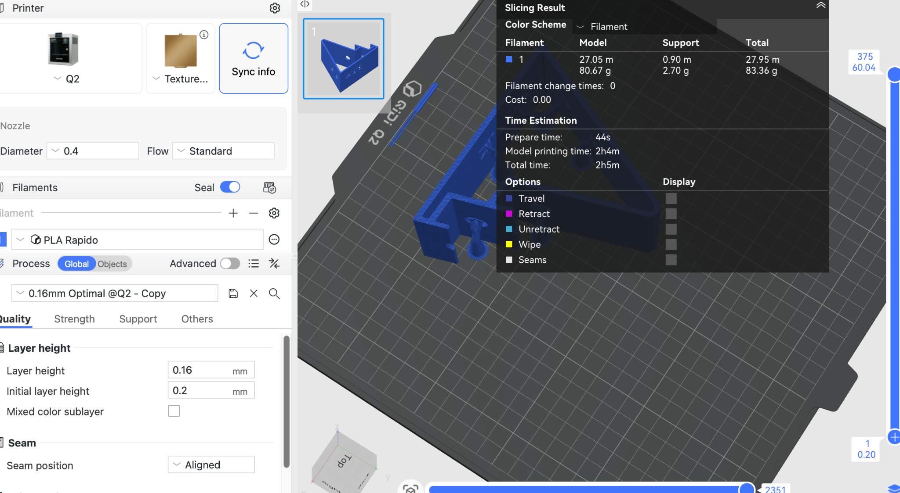

---

## Challenges

The most challenging part of this exercise was understanding how parametric CAD works. At the beginning, some sketches were not fully defined, and some dimensions or constraints caused conflicts when I tried to edit the shape. I learned that it is better to define the important geometry clearly and avoid unnecessary constraints.

Another challenge was understanding the slicer warnings. At first, QIDI Studio showed warnings related to the model orientation and unsupported regions. By checking the layer preview, changing the orientation, and enabling Tree Supports, I better understood how the model should be placed and prepared for printing.

Another challenge was understanding why the estimated weight in Onshape differed from the weight shown in QIDI Studio. At first, I expected both values to be identical, but I learned that CAD software calculates the weight of the complete solid model, while slicing software estimates only the material that will actually be printed based on the selected print settings.

---

## Reflection

This exercise helped me understand the complete workflow of additive manufacturing, from parametric CAD modelling to manufacturing preparation. I learned that designing a printable object involves much more than creating a 3D shape. The model must be fully constrained, suitable for fabrication, and carefully prepared in slicing software before printing.

I also learned how useful fully defined sketches are in Onshape. When the sketch is properly constrained, it is easier to change dimensions later without breaking the whole model. The exercise also helped me understand how CAD modelling and slicing software work together to turn a digital design into a physical object.

One of the most valuable lessons was understanding how design decisions influence the manufacturing process. Small changes in orientation, support structures, layer height, material settings, or nozzle-related parameters can significantly affect printing time, material consumption, and the quality of the final part.

---

## Final Printed Product

After receiving the printed model, I tested the final phone and tablet stand with different devices. The stand was printed successfully as one solid 3D-printed part. It can hold both a phone and a tablet in landscape and portrait orientation.

The front lips keep the device stable, while the back triangular support gives the model a good viewing angle. I also added cable-management holes so the device can be charged while it is placed on the stand. The holes on the backside can also be used for attaching the stand to a wall or another surface with screws. Another possible use would be attaching it with suction cup hooks, for example on a smooth surface.

The personal cut-out initials are visible on the base and side of the model. Overall, the final print is functional, stable, and usable for different device sizes and orientations.

| Phone in landscape mode | Phone in portrait mode |
|:-----------------------:|:----------------------:|
| 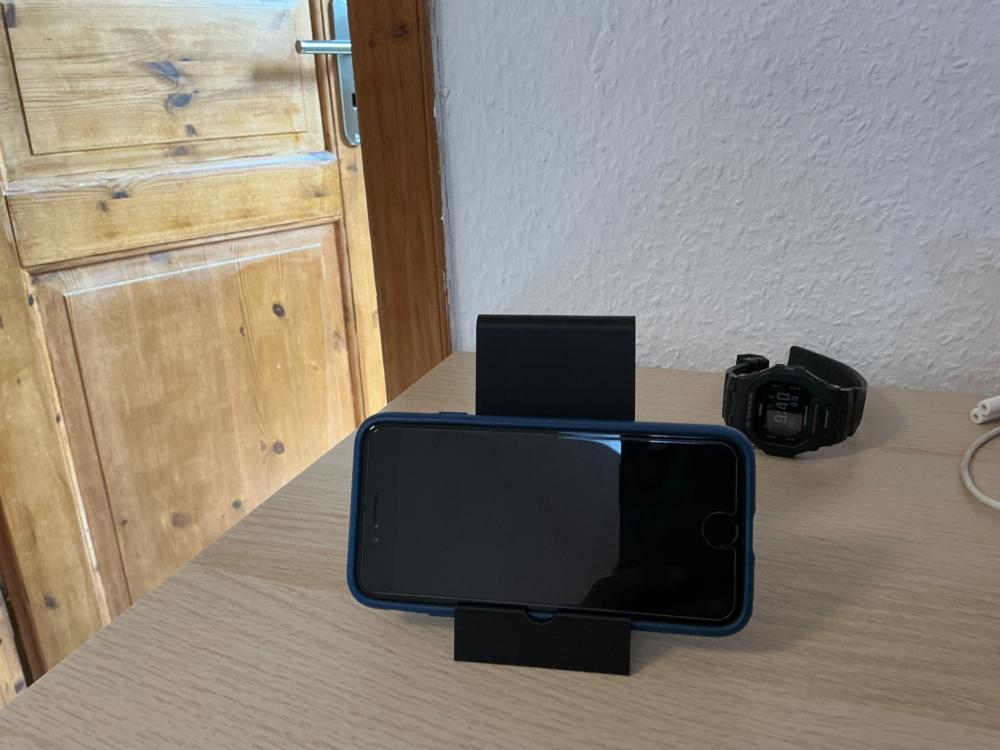 | 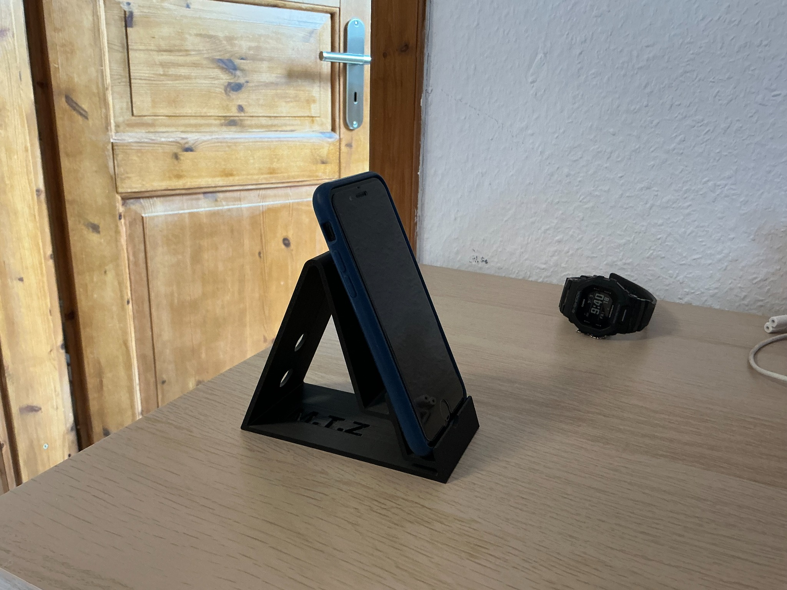 |

| Side view of printed stand | Front/side detail |
|:--------------------------:|:-----------------:|
| 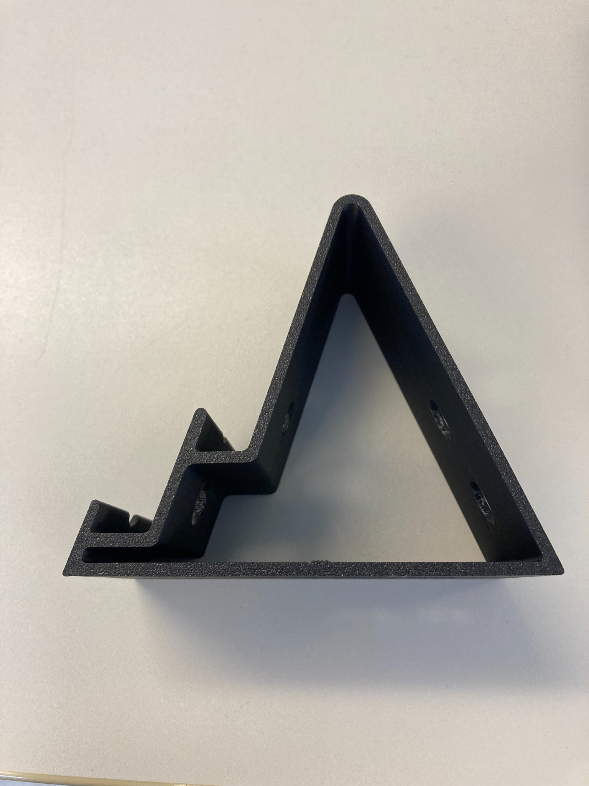 | 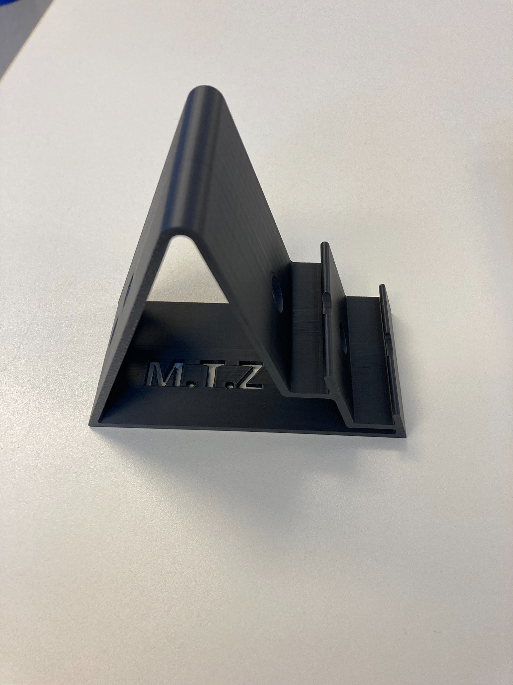 |

| Personal cut-out detail | Tablet test with cable management |
|:----------------------:|:--------------------------------:|
| 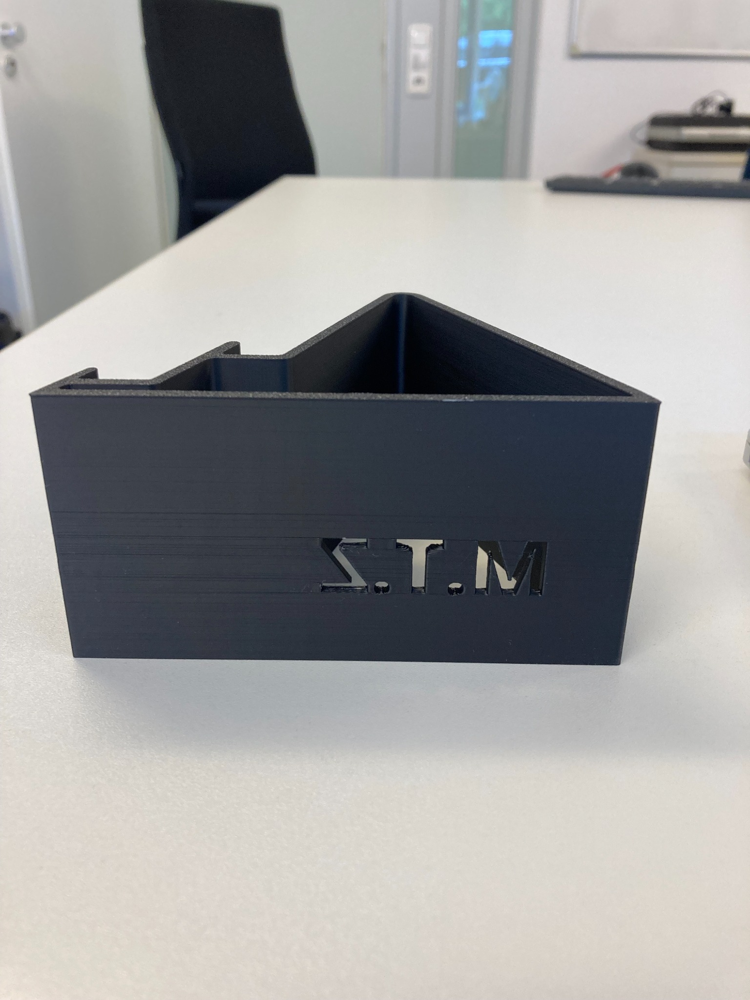 | 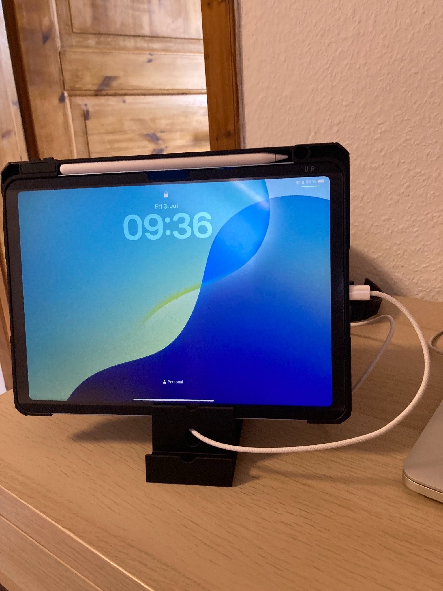 |
---

## Conclusion

I successfully designed a custom phone and tablet stand using Onshape and prepared it for 3D printing in QIDI Studio. The project included studying an inspiration model, creating fully defined sketches, extruding the main body, adding a cable opening, creating a personal "M.T.Z" cut-out, and preparing the model for printing with QIDI Q2.

This exercise improved my understanding of parametric CAD, design constraints, slicer preparation, support generation, material estimation, and the connection between digital modelling and physical fabrication.
